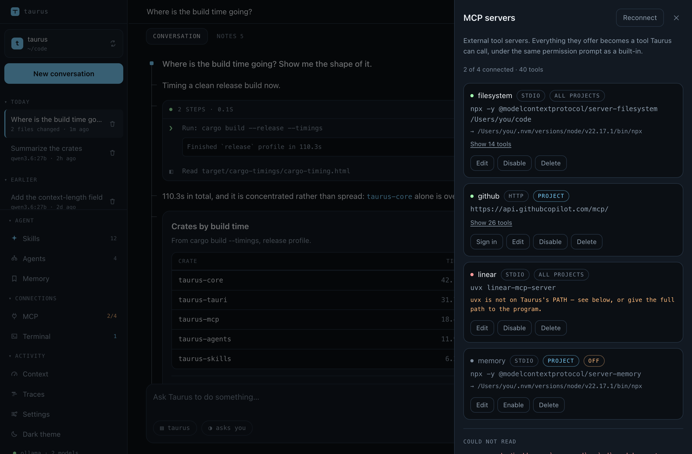
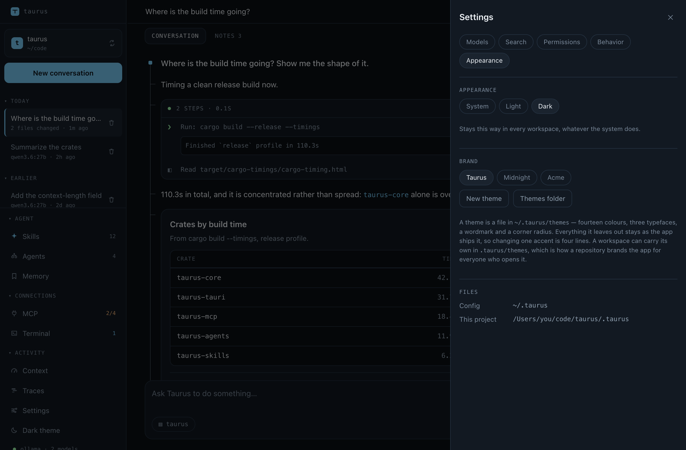

# Taurus AI Shell

An agent harness that runs against any model provider — local Ollama, anything
OpenAI-compatible, Anthropic, or Google Gemini. Rust underneath, with two
frontends over one shared core: a Tauri v2 desktop app and a `taurus` CLI.
macOS, Windows, and Linux from one codebase.

It reads and edits files in a workspace, runs commands, searches the web,
connects to MCP servers, delegates to sub-agents, reads screenshots you paste
in, leaves itself notes so the next conversation in a workspace does not start
from nothing, and finds code by what it does rather than what it is called — and
writes down procedures it works out as reusable **skills**, which you approve
before they are kept. It reads the `AGENTS.md` and `CLAUDE.md` you already have
rather than asking for a seventh copy. Every file it edits is recorded first, so
any turn can be **rewound** — or read back as a diff and **committed on its
own** — and every write is shown as a diff before you approve it.


A turn folds its tool calls into one card, so a nine-step turn reads as one step
of the conversation. Results the model means you to *look* at — a table, a chart
— stand on their own beside the prose rather than inside that card.


When a decision is genuinely yours, it asks and waits rather than guessing. Every
question can be skipped — "You decide" answers all of them at once — so the turn
never blocks on an answer that is not coming.


<sub>Regenerate with `pnpm screenshots`. These are the real interface driven by
fixtures in headless Chrome rather than photographs of a running window — see
[`scripts/screenshots/`](scripts/screenshots/capture.mjs) for why, and for what
that costs.</sub>

## Quick start

```bash
ollama serve                # in another terminal
```

Desktop app:

```bash
pnpm install
pnpm tauri dev
```

Or the CLI:

```bash
cargo install --path crates/taurus-cli

taurus repl                                     # interactive
taurus run "summarize the modules in src/"      # one-shot
taurus run --json "count the rust files" | jq   # for scripts
taurus rewind --to last                         # undo what the last turn wrote
```

Both share `~/.taurus` — same providers, same skills, same permission
allowlist. Approve a tool once in the app and your scripted runs inherit it.

## What is different about it

Most of the list further down exists in some form in every agent harness. These
are the parts that do not, each with the limit that comes with it — the same
limits are written out in full in [Known gaps](docs/known-gaps.md).

**It is built for the model on your own machine, not only the one in a
datacentre.** An 8k context window is the size every decision here is shaped
around. A fifty-skill library costs one line each in the prompt and loads a
procedure only when it is needed. The plan is rebuilt at the *tail* of every
request rather than in the system prompt, so a moved checkbox invalidates one
line of prompt cache instead of the tools and the whole conversation — 75
seconds against 194 on the same three-step task. Tool schemas are slimmed on the
way out, old tool results shrink before anything is summarized, and a model with
no tool-calling API at all still calls tools, through prompted parsing the core
cannot distinguish from the native path. What this does not do is make a small
model a large one; it makes one affordable to actually run an agent on. See
[the context window](docs/working-with-it.md#the-context-window).

**One core, two frontends, one state directory.** The desktop app and the
`taurus` CLI are the same agent — `Host::build_agent` is the single place a
session is assembled, and a frontend contains no agent logic, only how a
permission prompt is asked. So a tool approved in the app is approved for a
scripted run, a conversation started in one is resumable in the other, and the
agent loop is testable against a scripted provider with no GUI anywhere near it.
They are not identical surfaces: reading a turn back as a diff and committing it
are the app's, and the terminal dock is desktop-only on purpose. See
[How it is put together](#how-it-is-put-together).

**Undo covers what a command did, not only what a tool declared.** `edit_file`
can say which file it is about to change; a command line cannot. So the
workspace is read before every command and again when it finishes, and the
difference is the answer — `sed -i` across a dozen files, a `rm` that took the
wrong directory, a script the model wrote and ran, all of it comes back, from
the files as they stood before it ran. No git required, and it works for a
command left running in the background across turns. The same log read forwards
is a diff of any turn, and the offer to commit that turn on its own. The two
things it cannot restore say so before you press anything: `.git`'s own state,
and anything under a directory an ignore rule excludes. See
[Rewinding a turn](docs/safety.md#rewinding-a-turn).

**It reads the configuration you already have, and never writes back to it.**
`AGENTS.md`, `CLAUDE.md`, `.github/copilot-instructions.md` and Copilot's
scoped `*.instructions.md`; skills from `.claude/skills`, `.copilot/skills` and
`.github/skills`; sub-agents from Claude's and Copilot's own directories; MCP
servers in the `mcpServers` format Claude Desktop uses. A borrowed file is read
and never rewritten — retuning a Copilot agent saves a Taurus-owned copy beside
it and shadows the original, because that file is committed, Copilot is still
reading it, and it carries keys Taurus has never heard of. The honest limit is
that borrowing is not emulation: an `applyTo` glob becomes a sentence in the
prompt, because a brief here is assembled once per turn rather than attached
when a matching file is touched. See
[Instructions](docs/capabilities.md#instructions).

**A repository you just cloned does not get to configure your agent.** A
workspace's `.taurus` starts processes, names the endpoint your conversation is
sent to, and can carry standing permission grants — and all of it arrives with
`git clone`. So an untrusted workspace contributes *no* config at all, one rule
in one direction, and you are asked only when the folder actually holds
something, with the MCP command lines named rather than counted. What that is
not is a sandbox: it decides whether a project may configure Taurus, not what
running that project's build script does. See
[Trusting a workspace](docs/safety.md#trusting-a-workspace).

**A data file is a surface, not a wall of text in the context window.** A CSV
with a million rows in it is the most expensive mistake an agent can make with
`read_file`. Instead it is loaded as a table, profiled from every row rather
than a sample, and asked questions in SQL that is planned and refused if it does
anything but read — with the rows on a pane of their own and never in a tool
result. A transformation worth keeping becomes a recipe: SQL committed with the
code, re-runnable on next month's export, reporting what each step did to the
row count. The commitment that comes with it is the dialect — a recipe is
DataFusion's SQL in a file in your repository. See
[Working with data](docs/working-with-it.md#working-with-data).

## What it does

Each of these has a section of its own. The one-liners are here so you can tell
from this page whether the thing you want exists.

**[Capabilities](docs/capabilities.md)** — what it reaches for, and what it
writes down.

- [**Instructions**](docs/capabilities.md#instructions) — reads the `AGENTS.md`
  and `CLAUDE.md` you already have, rather than asking for a seventh copy.
- [**Skills**](docs/capabilities.md#skills) — works a procedure out once, writes
  it down, and asks before keeping it. You approve; nothing is saved behind your
  back.
- [**Memory**](docs/capabilities.md#memory) — writes down what the next
  conversation in this workspace would otherwise have to be told again. You can
  read every note, and forget any of them.
- [**Sub-agents**](docs/capabilities.md#sub-agents) — delegates to a scoped
  context with its own tools, so a search that would fill the window happens
  somewhere else.
- [**Slash commands**](docs/capabilities.md#slash-commands) — one namespace over
  skills, sub-agents, and built-ins.

**[Permission, and undo](docs/safety.md)** — what it asks before acting, and how
to put things back after.

- [**Permissions**](docs/safety.md#permissions) — every write is shown as a diff
  before you approve it, and a decision can be remembered for this project or
  everywhere.
- [**Hooks**](docs/configuration.md#hooks) — your own programs run at fixed
  points in a turn, able to refuse a call and never to approve one.
- [**Trusting a workspace**](docs/safety.md#trusting-a-workspace) — a cloned
  repository's own config does not configure your agent until you say so, and
  you are only asked when the folder actually holds something.
- [**Running commands**](docs/safety.md#running-commands) — a real PTY per
  platform, so a program that checks `isatty` behaves the way it does in a
  terminal.
- [**Commands that keep running**](docs/safety.md#commands-that-keep-running) —
  a build from cold, a whole test suite, or a dev server is started and left
  alone rather than waited for. What it changed is still undoable, from the
  files as they stood before it ran.
- [**Rewinding a turn**](docs/safety.md#rewinding-a-turn) — every file a turn
  touched is recorded first, so any turn can be undone.
- [**Keeping a turn**](docs/safety.md#keeping-a-turn) — read a turn back as a
  diff and commit it on its own.

**[Working with it](docs/working-with-it.md)** — what a turn looks like in use.

- [**Sessions**](docs/working-with-it.md#sessions) — transcripts on disk, per
  workspace, replayable.
- [**Finding a conversation**](docs/working-with-it.md#finding-a-conversation) —
  ⌘K opens one box over the window: every panel and verb by name, conversations
  by title, and the transcripts themselves by what was said in them. A hit
  opens the conversation *at* it.
- [**Planning a long task**](docs/working-with-it.md#planning-a-long-task) — a
  plan it pins and keeps current, rather than one it announces once and forgets.
- [**Showing it a picture**](docs/working-with-it.md#showing-it-a-picture) —
  paste a screenshot in.
- [**Finding code by what it does**](docs/working-with-it.md#finding-code-by-what-it-does)
  — local semantic search, no service.
- [**When a turn stops**](docs/working-with-it.md#when-a-turn-stops), and
  [**the context window**](docs/working-with-it.md#the-context-window) — what
  ends a turn, and what it costs.
  The meter above the composer says how much; pressing it says *on what* — a
  row per tool, the calls that repeated an earlier one exactly, and what every
  request pays before the conversation starts.
- [**Tables, charts, diagrams, and questions**](docs/working-with-it.md#tables-charts-diagrams-and-questions)
  — results you are meant to *look* at stand on their own beside the prose, a
  sequence or flow diagram included. When a decision is genuinely yours, it asks
  and waits — and every question can be skipped.
- [**Code is coloured, and so is a diff**](docs/working-with-it.md#code-is-coloured-and-so-is-a-diff)
  — a fenced block by its fence, a diff by the file's own extension, one
  palette for both and for the query box. And where one line was rewritten
  into another, the characters that actually differ are marked inside it.
- [**Motion that says what it is doing**](docs/working-with-it.md#motion) — a
  turn in flight draws a waveform whose shape comes from the kind of work
  running, and a running row wears a scan, a write gutter, or an indeterminate
  hairline. A spinner says a turn is alive; this says what it is busy with.
- [**Working with data**](docs/working-with-it.md#working-with-data) — a CSV
  with a million rows in it is not a file to read. It loads one as a table
  instead, describes every column from the whole file rather than a sample,
  answers questions about it in SQL, and puts the rows on a surface of their
  own. A transformation worth keeping becomes a
  [**recipe**](docs/working-with-it.md#recipes): a chain of SQL steps committed
  with the code, re-runnable on next month's export, reporting what each step
  did to the row count.
- [**A query box that knows your columns**](docs/working-with-it.md#writing-the-query)
  — SQL coloured as you type, completing against the real schema of every
  loaded file rather than a keyword list. A column two files share is marked
  `joins`, which is how you find the key to join them on while writing the
  join.


The pane does not exist until a workspace has loaded something. It takes the
centre column beside the conversation rather than covering it, and the box you
type in never moves — asking is still how anything gets here.

It goes both ways. A message sent from the pane carries what is on screen, so
"which category refunds most?" has a referent. A query the model ran leaves a
card in the transcript with **Run in Query** on it, which asks the same
question again in the pane at full width. A query that fails, and a recipe run
that does, each offer themselves back to Taurus with the error already in the
message.

**[The canvas](docs/capabilities.md#the-canvas)** — a file open beside the
conversation, not instead of it.

Ask to see a file and it opens in an editor to the right of the transcript.
"Show me where the retry logic is" opens on that passage with it selected — the
model passes the lines it means, so it can point rather than quote.


Select a passage and **Ask about this** starts a sentence in the message box.
What travels with that message is the selection itself — which file, which
lines, and what they said — so "tighten this" is a complete question, which it
is on screen and is not in a transcript. The chip above the box says so while
you type, because context you cannot see is behaviour you cannot explain.

You can type in it, and it saves itself a second after you stop. That is not a
convenience: the whole argument for the canvas is that you and Taurus are
looking at the same file, and an unsaved buffer breaks it silently — you would
ask about the paragraph on screen and get an answer about the one on disk.

Taurus writes files too, and neither of you waits for the other. If it changes
the file you have open and you have typed nothing, the editor takes the new
version and tints what moved. If you *have* typed something, nothing is taken:
both versions are kept and you are asked which survives.


A save never overwrites something it has not seen — the editor holds the
fingerprint of the file as it read it, and a save that no longer matches is
refused rather than applied. The race is closed at the write, not papered over.

**[Configuration](docs/configuration.md)** — providers, keys, MCP servers, and
web search.

- Local Ollama, anything OpenAI-compatible, Anthropic, or Google Gemini.
- Keys live in the OS keychain or an env var, never in a config file.
- Everything the Settings drawer writes is a plain file the CLI reads too.
- [**MCP servers**](docs/configuration.md#mcp-servers) — add and test them in
  the app, in the same `mcpServers` format Claude Desktop uses.
- [**Themes**](docs/configuration.md#themes) — fourteen colours, three
  typefaces, a wordmark and a corner radius, in a file you can commit. A
  workspace can carry its own, so a repository brands the app for everyone who
  opens it.





**[Development](docs/development.md)** — tests, the live checks, the app icon,
regenerating these screenshots, and cutting a release.

**[Known gaps](docs/known-gaps.md)** — what it does not do, written down where
you can read it before you discover it.

## How it is put together

```
crates/
  taurus-provider/          Provider trait + normalized message/stream types
  taurus-provider-ollama/   Ollama adapter (NDJSON, per-model capabilities)
  taurus-provider-openai/   OpenAI-compatible adapter (SSE, vLLM/LM Studio/…)
  taurus-provider-anthropic/ Anthropic Messages API (probed capabilities, caching)
  taurus-provider-gemini/   Google Gemini (generateContent, OpenAPI-subset schemas)
  taurus-tools/             Tool registry, built-in tools, permission gate, undo
  taurus-skills/            Skill discovery, execution, and authoring
  taurus-agents/            Sub-agent definitions and discovery
  taurus-mcp/               MCP client
  taurus-web/               Web search and page fetching
  taurus-index/             Local semantic search: chunking, embedding, ranking
  taurus-data/              Reading, profiling, and transforming tabular files, behind one engine trait
  taurus-core/              Session state, the agent loop, sub-agents
  taurus-host/              Config, system prompt, registry assembly
  taurus-cli/               The `taurus` binary
src-tauri/                  Windows and IPC — no agent logic
src/                        React UI
```

One rule holds the design together: **a frontend contains no agent logic.**
Everything a session *is* — config files, system prompt, tool registry, skill
library — lives in `taurus-host`, and `Host::build_agent` is the single place
they come together. The desktop app and the CLI differ only in how they talk to
a person: how a permission prompt is asked, and where a skill proposal goes.
Both are traits.

That is also why the agent loop can be tested against a scripted provider, and
why the [live checks](docs/development.md#live-checks) run without a GUI.

### Provider-agnostic, concretely

The normalized types use Anthropic-style content blocks rather than OpenAI's
`tool_calls` shape, because blocks are the superset — a single assistant turn
with interleaved text, reasoning, and several tool calls survives the round
trip; the other direction does not.

Three things prove the abstraction rather than assert it:

- **Every adapter after the first required no change to `taurus-core`.** The
  OpenAI one differs in transport (SSE vs NDJSON) and tool-call encoding
  (arguments as a string assembled across frames vs a whole object). Gemini
  differs in what a conversation *is*: the assistant is called `model`, tool
  calls carry no ids at all, results pair with calls by name, schemas are an
  OpenAPI subset rather than JSON Schema, and every streamed chunk is a whole
  response object rather than a delta envelope. None of that reached the core.
- **Models without tool support still call tools.** `gemma3` accepts no `tools`
  parameter at all. The harness detects that from Ollama's capability probe and
  switches to prompted tool calling, parsing `<tool_call>` blocks out of the
  text stream into the exact same events a native adapter emits. `taurus-core`
  cannot tell which path a turn took.
- **A backend that reports itself is asked rather than configured.** Ollama and
  Anthropic both answer questions about their own models, so neither needs a
  `context_length` in `providers.json` and neither can be told the wrong one.

## License

MIT. See [LICENSE](LICENSE).
