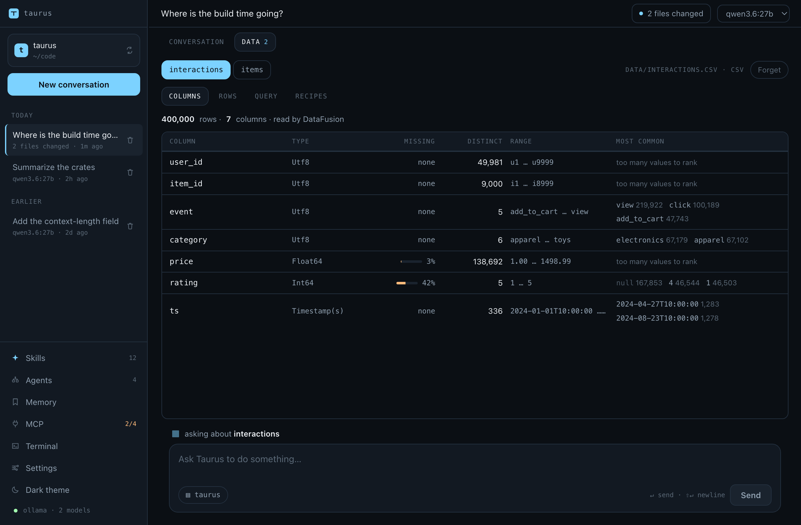

# Working with it

<sub>[← Taurus AI Shell](../README.md)</sub>

What a turn looks like in use — where the transcript lives, how a long task
is planned, what you can hand it besides text, and how it decides when to
stop.

## Sessions

Every conversation is written as it happens, so closing the app or the terminal
does not end it:

```bash
taurus sessions                       # this workspace's, newest first
taurus repl --resume                  # pick up the most recent one
taurus run --resume <ID> "and now…"   # continue a named one
```

The desktop app reopens its last conversation for the workspace on launch, and
its left rail lists the rest — today's, then everything earlier — so switching
between them is one click rather than a drawer.

Changing the model, or the backend, keeps the conversation. Pick another from
the topbar and the transcript comes with it — which is the point, since the
usual reason to reach for that picker is a second opinion on the question you
just asked. A line is drawn across the transcript where it happened, and the
change is written down, so reopening the conversation later continues it on the
model it was last worked in rather than the one it was opened with.

None of this needs translating. A transcript holds blocks, not any provider's
wire format: each backend renders them into its own on the way out, drops the
reasoning it has no way to replay, and rewrites tool calls as plain text for a
model with no native tool support. What does change is what the model can do.
A smaller context window compacts on the next turn, because the budget is
recomputed per turn from whatever model the conversation is on. A model that
cannot read images is sent the conversation with each picture replaced by a line
saying one was there — the images stay in the session and in the transcript, so
moving to a model that can see brings them back.

Switching is refused mid-turn. A turn reads the model out of the session on
every attempt, so moving it underneath one would send half an answer to one
backend and half to another.

A conversation belongs to the folder it was started in, and changing folders is
a move rather than a setting. Its transcript is filed under that workspace, its
checkpoints are keyed by it, and every path it has ever mentioned describes that
tree — so picking a new workspace closes the conversation on screen and opens
what the new folder has, exactly as launching into that folder would: its most
recent conversation, or a fresh one on the provider and model it was last worked
in. The conversation you left is not gone; it is in the rail of the folder it
belongs to, and reopening it there picks up where it stopped. A turn sent to a
conversation from somewhere else is refused rather than run, which is a rule the
backend keeps rather than one the window is trusted with.

Switching is refused while a turn is running. The move reconnects every MCP
server, so the tools the turn is holding would start failing mid-call — stop it
first.

A conversation appears in the rail once it has something in it — the moment the
first question is asked, not when the answer arrives. A turn that runs for two
minutes is in the list, with its name, for all of them, and a turn interrupted
by a crash leaves what was asked rather than nothing. Starting a conversation
and changing your mind, or trying three models before asking anything, still
leaves nothing behind.

A conversation is named after the first thing asked in it, which is a good name
for about as long as it is still about that. Click the name in the topbar to
change it: Enter or clicking away saves, Escape discards, and emptying the field
puts the derived name back. The name is stored in the transcript's own header,
so it travels with the conversation and survives being copied out — and renaming
is allowed while a turn is running, since it touches nothing the turn is writing.

Transcripts live in `~/.taurus/sessions/<workspace>/<id>.jsonl`, in the global
config home rather than in the project. They hold file contents, command
output, and MCP responses; kept inside the workspace they would be committed by
accident. Keying the directory by workspace gives back the only thing that
location cost — "show me this project's sessions" — without putting any of it in
the repository.

The file is append-only, one JSON object per line: a header, then each message
as it is produced. Nothing is rewritten, so a crash costs the turn in flight
rather than the conversation, and a half-written final line is dropped on load
instead of poisoning the file. There is no index — everything a listing shows is
in each transcript's own opening lines, and an index is a second copy of the
truth that can disagree with it.

Renaming is the one exception, and it keeps that promise rather than breaking
it. A name has to live in the header, because a listing reads the top of the
file and stops; appended to the end of a long conversation it would be invisible
to every screen that could show it. So a rename writes a complete new file
beside the old one and moves it into place. Until that move the original is
untouched, and the move itself either happens or does not. Every line but the
header is copied through byte for byte — a record from a newer version survives
being renamed by an older one, and a torn final line stays exactly as torn as it
was.

The header records the workspace, the model the conversation *started* on, and
the branch that was checked out — see [Conversations know their branch](safety.md#conversations-know-their-branch).
A transcript written before that field existed simply has no branch, which is
why it defaults rather than being required: an upgrade must not make every
existing conversation unlistable.

## Planning a long task

A frontier model keeps a six-step task in its head. A 9B model does not — and
not because it forgot the steps. They are still there, twenty messages back,
behind a wall of tool output, competing with everything else for attention.

So `update_plan` writes a checklist, and the checklist is not left in the
history. It is rebuilt onto the **end of every request** — the very last thing
the model reads before deciding what to do next, written onto the copy being
sent and never into the conversation being stored:

```
# Your current plan

You wrote this with update_plan. It is restated here every time because it is
the record of where you are:

1. [x] Change the greeting in main.rs
2. [>] Add version to config.toml
3. [ ] Compile and confirm it prints hello

Call update_plan again the moment a step's state changes — send the whole list
back with the states updated. Work the step marked [>], and do not start
another until it is [x]. Closing the last step is a call to update_plan, not a
sentence in your reply: when the work is done, send the whole list back with
every step 'done' first, and then say what you did and stop.
```

The same list is drawn in the transcript, so the user is reading what the model
is reading.

**Why the end, and not the system prompt.** It used to hang off the end of the
system prompt, which reads like the end of something and is in fact the very
beginning of a request — ahead of the tool schemas and every message in the
conversation. A backend serving a prompt reuses the longest identical prefix of
one it has already processed, and `update_plan` is called at the start and the
end of every step, so a plan sitting up there threw away the tools and the whole
conversation each time a checkbox moved. On one local 30B, a 9,550-token prompt
costs 16ms to repeat unchanged and 10,933ms to repeat with a single line of the
plan edited; the same three-step task ran in 75 seconds with the plan at the end
and 194 seconds with it at the front. On Anthropic it is the same fact with a
price on it — the cache breakpoint sits on the system field and covers the tools
rendered before it, so a moved plan misses both. At the tail the plan
invalidates only itself, and it is nearer the model's attention than it was
before rather than further away.

Three properties do the work, and each one is a test:

- **The whole list, every time.** There is no step id to quote back and no
  add/complete/remove protocol to get half right. A small model cannot reach a
  state it did not literally write out, and the payload being identical to its
  own input is what lets a reopened conversation redraw a plan nothing
  recomputed — the same identity `show_table` and `ask_user` rely on.
- **One step in progress.** Refused if more, naming which ones. A checklist with
  three things active says nothing about where the turn is, which is the single
  question it exists to answer.
- **States only move forward.** A step marked done that comes back as `todo` or
  `active` is refused, and so is a list where a finished step sits below an
  unfinished one. Both are the model having lost its place rather than a plan it
  meant to write — and because the list is replaced wholesale, a re-typed list
  that simply leaves the states off would otherwise undo every step it had
  finished, silently, since an absent state reads as `todo`.
- **Nothing when there is no plan.** Not an empty section — nothing at all. A
  standing instruction to keep a checklist is exactly how a two-step turn grows
  a six-step plan.

It is rebuilt rather than appended for the same reason it is not a message: a
copy pushed per iteration would accumulate, each staler than the last, leaving
the model to work out which of nine checklists is current. There is only ever
one, and it is always live.

**The checklist is pinned above the composer, not drawn in the transcript.**
That follows from what it is: not a thing that happened at a moment, but where
the work is *now*. In the flow it scrolls away behind the twenty tool calls it
was written to organize, and the panel that answers "where are we" is the one
you have to go looking for. Pinned, it is on screen at the moment anyone asks.

It is one line by default — a bar, the live step, a count — and opens to the
full list on a click. The transcript is the window's whole purpose, and a
seven-step list nailed permanently across the bottom of it would spend a third
of the reading area saying what 30px says. Opened, it stays open: the model
rewriting the plan is not a reason to shut it under someone who was watching
the steps.

Only the newest plan is pinned. The model rewrites the whole list every time a
step starts or finishes, so a six-step task ends with seven calls; each keeps
its row in the run header, and only the last one has a checklist to show. A
finished plan stays up until you ask for something else — "done" is worth
getting to see, and last hour's completed checklist sitting over an unrelated
question is not. An unfinished one stays regardless, which is most of the point.

**An unfinished plan survives into the next message**, in the prompt as well as
on screen. It has to: a six-step task is very often six steps and a question in
the middle of it, and a checklist that evaporated the moment you answered "yes,
go on" was one the model then rebuilt from memory — the drift the plan exists to
stop, arriving one turn later.

What does not survive is a *finished* plan. Every step marked `[x]` means the
work it described is over, and restating it would tell a model asked about
something else that its standing instruction is "say what you did and stop".
That is the whole staleness rule, and it is the same one the panel follows —
which is not a coincidence: what you read above the composer and what the model
reads in its prompt are the same checklist, and they would be worse than useless
if they disagreed about whether it was still live.

A carried plan is labelled as carried. The model is told these steps predate the
message it is answering, and that it should call `update_plan` with a new list
if the request has moved on. Only the model has read the follow-up, so only the
model can decide whether it continues the task or changes it; the harness
declining to guess is the honest version of that. Rewinding a turn drops the
plan, for the same reason it drops the files: it was working state for work that
has been undone.

**Whether a model reaches for it is the model's own judgement.** On a five-step
mechanical task, both `qwen3.6:27b` and `qwen3.5:9b` did the work correctly and
never called it; asked to plan, the 27B kept the list accurate through every
step. The prompt now says when to plan and when to update, which is the whole of
what the harness can do about it. See [Known gaps](known-gaps.md).

## Showing it a picture

Every provider adapter here could always *send* an image — `ContentBlock::Image`
maps onto Ollama's `images` array, OpenAI's `image_url`, Anthropic's `source`,
and Gemini's `inline_data` without loss. What none of them had was a way for one
to arrive. Now paste or drop one into the composer:

```
┌──────────────────────────────────────────┐
│  [thumb] [thumb] ✕                       │
│  why is this layout wrong?               │
│  ▤ taurus-ai-shell   ↵ send · paste an image │
└──────────────────────────────────────────┘
```

Both are refused outright on a model that cannot see, rather than accepted and
turned down a round trip later. That check is per *model*, not per provider:
on one Ollama server `gemma4:12b` reads images and `llama3.2` does not, and the
composer only advertises paste when the session's model reports vision.

Everything else checkable is checked before the turn starts, because an image
rejected by a provider comes back as a wire error naming a field in the request
body — the least useful thing to hand someone holding a screenshot. So:

- **The format is one every backend takes** — PNG, JPEG, WebP, GIF. The
  intersection, not the union: Gemini would accept HEIC and Anthropic would not,
  and a format that works until the day you switch provider is worse than one
  that never worked.
- **The bytes really are that format.** A clipboard flavour and a file extension
  are both wrong often enough to matter, so the magic number is compared against
  what the file claims. A `.png` that is really a JPEG is named here rather than
  on the wire.
- **Four at most, five megabytes each.** An image is budgeted at a flat 1000
  tokens because its real cost has nothing to do with its base64 length, and
  this harness is built for 8k windows — four images is already half of one.

Images precede the text in the message, which is the order the model reads them
in and the order the transcript draws them. A reopened conversation rebuilds the
strip from the transcript's own `image` blocks, so the screenshot is still
beside the question that asked about it.

### A tool can hand one back

The other direction, and the newer one. A tool's answer is a list of blocks
rather than a string, so a tool that took a screenshot, rendered a chart, or
rasterized a page of a PDF can return the picture itself:

```
mcp__playwright__screenshot  https://example.com

  ✓ the page as rendered
  [thumb]
```

The blocks are text, image, and JSON, and which one a tool means is stated
rather than guessed. Text that happens to look like JSON stays text — a
`read_file` on a `.json` returns JSON-shaped prose, and a tool whose output
changed shape depending on the file it was pointed at would be worse than one
that never structured anything.

**MCP servers get this for free and were the reason for it.** A server that
screenshots a page used to have its whole answer flattened to the literal words
`[image: image/png]`, because the normalized types had nowhere to put a picture
inside a result. That is now the picture.

**Only Anthropic carries an image inside the result.** OpenAI's `role: "tool"`
message, Gemini's `functionResponse`, and Ollama's tool message are all text, so
there the image travels immediately after the result — as its own user message
on OpenAI and Ollama, as further parts of the same content on Gemini — with a
line naming the call it answers. The result itself keeps a marker where the
picture was, so a tool that returned a sentence and a chart does not appear to
have returned only the sentence.

**On a model that cannot see, an image becomes a line saying so.** Not dropped:
a tool whose only answer vanished reads as a tool that did not work, and the
truth is that it worked and this model cannot look at the answer.

Every image a tool returns is checked by the same rules a pasted one is — the
four formats, the magic number against the declared type, the five-megabyte
cap — because a built-in with a bug and an MCP server nobody here wrote are
equally capable of producing something no provider will take. One that fails is
replaced by a line naming the tool and saying why, which is what the model needs
to decide whether to call it differently.

## Finding code by what it does

`grep` answers *where does this string appear*. The question someone actually
has on an unfamiliar repository is *where is the code that does this*, and the
only way to answer it with grep is to already know what the thing is called.

An embedding index is normally a cloud dependency: a service to send your code
to, a bill, and a vector database to run. For a local-first harness it is none
of those — the machine already has a model server on it, so the index is one
more endpoint on the same server and the vectors are a file in the config home.

```
search_code  "where the conversation transcript is written to disk"

  0.677  crates/taurus-host/src/sessions.rs:121-160
  0.635  src/state/store.ts:61-100
  0.593  scripts/screenshots/fixtures.ts:1-40
```

Those are real results from this repository, and the first one is right. It
matters most at 8k, which is the size everything here is shaped around: a
context that small cannot afford three wrong `read_file` calls, and each one is
a page of tokens spent on a file that turned out not to be the answer.

**It refreshes before it searches, not on a timer.** A model that just wrote a
file and then looks for it has to find it; an index refreshed on a schedule
answers from before the edit, which is worse than no index because the answer
looks right. Only files whose length or modification time moved are re-read —
the same comparison `make` and `rsync` have always used. On this repository:

```
first pass:     44.4s  Indexed 212 files (2498 chunks)
second pass:   53.4ms  Index is current: 212 files, nothing to re-read
               2498 passages, 10.1 MB on disk
```

Three deliberate simplicities:

- **Line windows, not syntax.** Forty lines with ten of overlap, in every
  language. A parser per language would cut at function boundaries and produce
  better chunks — and would need a grammar for everything in the workspace,
  would silently fall back on the ones it lacked, and would go wrong quietly on
  a file it half understood. The overlap is what stops a seam being a blind
  spot: a function split across a boundary is otherwise half in each chunk and
  whole in neither.
- **A loop over every vector, not an ANN index.** Twenty thousand vectors of 768
  dimensions is fifteen million multiply-adds — under a millisecond, and dwarfed
  by the round trip to embed the query. An approximate structure would buy
  nothing measurable and would add something that can be subtly wrong, returning
  *nearly* the right answers, which is far harder to notice than returning none.
- **One hit per file.** A query that matches a file usually matches three
  consecutive chunks of it, and three windows of one function is a worse answer
  than three places to look.

The index lives in `~/.taurus/index/<workspace>/`, beside the transcripts and
checkpoints and keyed the same way, for the same reason: it holds the contents
of files in the project. It is readable by its owner and nobody else. Unlike the
sweep, it respects ignore rules for *files* as well as directories — the sweep
looks past an ignored `.env` because that is exactly the file you want to undo,
while an index is a thing the model searches, and putting secrets in front of it
is the opposite of what anyone wants. `.taurus` is excluded too, so a search
over the project cannot answer with the conversation about the project.

## When a turn stops

A turn runs until the model stops asking for tools. Three things end one early,
and each records its reason in the transcript so a resumed session finds an
explanation rather than a conversation that simply stops:

- **The iteration ceiling** — twenty-five model/tool round trips by default. A
  ceiling rather than a budget the model is shown, because one it could see is
  one it could argue with.

  Adjustable in **Settings → Behavior**, or as `max_iterations` in
  `settings.json`, between 1 and 100. Raise it for long refactors that
  legitimately need more rounds; lower it to catch a model going in circles
  sooner. It is read per turn, so a change applies to the next message rather
  than the next launch, and it layers like everything else in that file — a
  project that needs long turns can raise it without loosening the ceiling
  everywhere. A hundred is the hard ceiling, the same one a sub-agent's
  `max_iterations` is validated against; a larger number in the file is clamped
  rather than refused, because a settings file that will not load is a worse
  answer to a typo than a number brought back into range.

  This is the *conversation's* limit, and a sub-agent's is its own — a delegate
  with thirty rounds spends one of the parent's, not thirty. Each agent's is on
  its card in the Agents drawer, which also names this number so the two are
  not read a screen apart.
- **A stall** — the same tool call, with the same arguments, failing three
  times with nothing succeeding in between. The system prompt already tells the
  model not to retry a failed call unchanged; this is what makes that true
  rather than merely stated. Counted across rounds rather than consecutively,
  so a model alternating between two dead ends — A, B, A, B, A — is caught as
  readily as one insisting on a single call. Anything that succeeds clears the
  count, which is what keeps a model working through genuinely different
  candidates from tripping it: a model re-reading a file it is editing is
  working, not stuck.
- **A provider failure no retry could fix** — a rejected key, an unknown model,
  a response that would not parse.

A rate limit or a 5xx is not in that last group. Those are retried up to three
times with a doubling backoff, and the wait is reported rather than silent,
because a pause nobody explained is indistinguishable from a hang. Cancelling
during a backoff returns immediately instead of serving out the delay.

One case is deliberately never retried: a request that had already begun
streaming an answer. The user has read the first half, and a second attempt
would write it again.

### One thing extends a turn

A turn that changed files and never ran anything afterwards is asked, once, to
check its own work before it is allowed to finish:

> You changed files and have not run anything since. Check that work now — run
> the project's tests, or build it, or run the thing you changed. If there is
> genuinely nothing to run against it, say so in one line and stop.

The system prompt says the same thing, and saying it there is not enough: a 9B
model edits a file and stops anyway. Asked at the moment it tries to finish, it
goes and runs the build.

What counts as having checked is a command that ran with nothing written after
it — the model asking the project a question and getting an answer, with no
edit since. The order decides, not which of the two happened: calls in one
message run in the order they appear, so a round that ran the tests and then
edited still owes a check, exactly as if the edit had come in a round of its
own.

The word doing the work there is *since*. It used to be enough for a round to
have written anything at all for the debt to stand, on the reasoning that a
command which wrote was doing work rather than asking a question. That cannot
see the case where the thing that wrote *was* the check: a test runner leaves a
`.coverage` beside the code, and a file an ignore rule excludes is one the sweep
looks past on purpose, so the run counted as work and the model was told it had
not run anything since — one line after running the tests and reporting them
passing. One command is still ambiguous and always will be: a `make` that builds
and formats, or a test run that updates its own snapshots, clears the debt now.
Nothing in a shell command distinguishes those from a test runner writing a
stamp, and a nudge that fires wrongly costs a round trip and says something
false, while one that stays quiet leaves a backstop unused.

Once per turn, and phrased with a way out, so a documentation edit costs one
round trip rather than an argument. `verify_changes` in `AgentConfig` turns it
off. The checkpoint log is what it reads to know whether anything changed,
which means it is exactly as accurate as the log — a command that only touched
files inside an ignored directory reads as having changed nothing.

## The context window

A local 8k model runs out of room in a way a hosted 200k one does not, so the
budget is managed rather than hoped for. Three things do the work.

**Reads come back a window at a time.** `read_file` returns 2000 lines by
default and takes `offset` and `limit` for the rest. Line numbers stay absolute,
so a number from a windowed read still means what it says, and a partial answer
always says it is partial — a window that does not announce itself is
indistinguishable from a short file, and a model that thinks it read the whole
thing will act on what is missing.

**Old tool output shrinks before anything is summarized.** Tool results are most
of what a working session holds, and every byte is re-sent on each iteration of
the turn. When history crosses the compaction threshold, two cheap rules run
first, with no model call involved: a result whose call was later repeated with
the same input is dropped down to a pointer at the newer one, and results older
than the verbatim tail keep their first few lines and say what went. Only if
that does not get under budget is the older half summarized. The block itself
always stays either way — replacing its text keeps every tool call paired with a
result, which is the thing providers actually validate.

**Nothing is advertised that the prompt cannot explain.** Every tool's schema
goes out with every request — not once per session, once per iteration of every
turn — so it is the one part of the prompt that is pure overhead. Three things
keep it down. Schemas are slimmed on the way out: `$schema`, the Rust struct
name `schemars` leaves in `title`, `"default": null`, and integer-width formats
are dropped, which is about a quarter of the built-in schema bytes and applies
to MCP servers' schemas too. `propose_skill` and `propose_agent` are each only
registered when their own setting is on, matching the prompt section that
explains each — they are the largest schemas here, and offering one while saying
nothing about it was paying for a tool the model had no reason to call. And
anything a project does not want can be named in `settings.json`:

```json
{ "disabled_tools": ["fetch_url", "mcp__some-server__rarely_used"] }
```

A disabled tool is not registered at all, so skills and sub-agents cannot reach
it either — a tool hidden from the model but still callable would be a
permission gap wearing a token-saving costume. A name matching nothing is
reported rather than ignored, because a typo otherwise looks exactly like a tool
that is quietly still on.

Five tools a turn adds for itself can be named here too, though `taurus tools`
does not list them: it prints the set a *sub-agent* could be scoped to, and
these five are exactly the ones a sub-agent never gets. They are
`spawn_subagent`, which is the delegation depth cap; `show_table`, `show_chart`,
and `ask_user`, which address the person watching this conversation; and
`update_plan`, whose checklist belongs to the turn that wrote it.

**Semantic search is off until a model is named.** `search_code` needs
something to embed with, so it is not registered until one is set — under
**Settings → Search**, or in `settings.json`, which is the same field:

```json
{ "embedding_model": "nomic-embed-text" }
```

By default it runs on the provider the conversation is already using — in a
local setup the embedding model is on the same server as the chat model, and a
second entry naming the same machine would be one more thing to keep in step.
Pull one first (`ollama pull nomic-embed-text`); the name is what the index is
keyed on, so changing it discards the index rather than mixing vectors that mean
different things. See [Finding code by what it
does](#finding-code-by-what-it-does).

**Name a provider when the conversation's cannot embed.** Ollama, any
OpenAI-compatible server — llama.cpp, LM Studio, vLLM, text-embeddings-inference,
OpenAI itself — and Gemini all serve embeddings. Anthropic does not; it has no
embedding endpoint at all and points at Voyage AI instead. So somebody chatting
to Claude names a second backend for the index rather than switching the
conversation to get one:

```json
{
  "embedding_model": "text-embedding-3-small",
  "embedding_provider": "openai"
}
```

Leave the provider empty and it follows the conversation, which is what a local
setup wants. The field appears under **Settings → Search** once a model is
named, and the two save together — a model with no provider would embed on
whichever backend the conversation happened to be on, which is exactly the case
this exists for.

**A reranker can be put in front of the results.** Optional, off by default, and
a second stage rather than a replacement for the first:

```json
{ "rerank_model": "bge-reranker-v2-m3", "rerank_provider": "llamacpp" }
```

Embeddings score a query and a passage separately and compare the two numbers,
which is what makes an index possible — every vector is computed once and kept —
and also what caps how good it can be. A reranker reads the query and the
passage *together*, which is markedly better and far too expensive to do against
a whole repository. So the cosine pass stops being the thing that picks the
answer and becomes the thing that draws up a shortlist of thirty; the reranker
picks five out of those. That division is worth the extra round trip at 8k for
the same reason the index is worth having at all: the cost of being wrong is a
`read_file` on a file that was not the answer.

`rerank_provider` is a separate setting from the embedding one because the
common local setup cannot serve both — Ollama has no reranking route at all.
A llama.cpp server started with `--reranking` is the usual second entry, and
anything speaking the Cohere-shaped `/rerank` route works: text-embeddings-
inference, Jina, Voyage, Cohere itself. Leave it empty if one server already
does everything, and it resolves to the one the index embeds on.

Two things follow from the scores not being comparable across backends. Results
say `relevance` rather than `similarity` once a reranker has ordered them,
because the number beside them is no longer a cosine and on a local llama.cpp is
routinely negative — a passage scoring −4.75 may still be the best answer in the
repository. And nothing is ever *filtered* by that number, only ordered by it.

Reranking never takes the search away. An unreachable server, a model that was
never pulled, or a backend with no such route leaves the similarity order
standing and says so in the log — the search already worked before this stage
existed, and an accuracy pass that could fail the whole tool mid-turn would cost
far more than the reordering is worth.

**The first index can be paid up front.** Embedding a repository takes the
better part of a minute, and left to itself that lands inside whichever turn
first reaches for `search_code` — a tool call that does not return while it
runs. **Build index now**, beside the model field, does the same work outside
any conversation, against a bar you can watch and a Stop that stops indexing
rather than a turn. It is the same refresh a search would have done, so nothing
is duplicated: build it here and the first `search_code` finds it current. Every
refresh after the first is cheap either way — only files whose length or
modification time moved are re-read.

**Where it went is a question you can ask.**

```bash
taurus usage            # this workspace's most recent session, by tool
taurus usage --all      # every session in this workspace
```

```
Turns              1
Messages           16
Billed by provider 20,440 in / 496 out
Transcript holds   ~1,407 tokens

Tool                    calls    ~tokens   share
read_file                   7      1,144    100%

Sent again with every request  ~1,982 tokens
  system prompt                 430
  10 tool schemas             1,552

Heaviest tool schemas
  propose_skill                 456
  read_file                     166
  run_command                   160
  edit_file                     156
  run_skill_script              151
  5 more                        463
```

The gap between the first two figures is the point: a transcript holding 1,407
tokens billed 20,440, and the bottom half is where the difference went — ~1,982
tokens of fixed overhead on each of seven requests. Per-tool numbers are
estimates, since a provider reports one total per request and never says which
part of the prompt was whose, but they use the same arithmetic that drives
compaction, so the report and the trigger cannot disagree. They are read back
out of the transcript rather than tracked beside it, for the reason the
transcript format already gives: a second copy of the truth can disagree with
it.

## Output formatting

Models answer in markdown, so both frontends render it.

The app parses markdown progressively as tokens arrive, tolerating the
half-finished constructs that streaming produces — an unclosed `**`, a code
fence with no terminator yet. Raw HTML is never rendered: model output is not
trusted markup, so `rehype-raw` is deliberately absent and any tags arrive
escaped as visible text. Links open in your browser rather than navigating the
webview away from the app.

The CLI applies ANSI attributes line by line: headings bold, `•` for bullets,
colored inline code, dimmed fenced blocks. With color off — piped, redirected,
or `NO_COLOR` — every line passes through byte for byte, so `taurus run >
out.md` still produces valid markdown.

The trade-off is that CLI prose appears a line at a time rather than a token at
a time, since a line has to be complete before it can be styled. The
alternative — redrawing the current line with cursor escapes — corrupts output
as soon as a line wraps.

## Tables, charts, diagrams, and questions

Five tools address the person watching rather than the machine. They change
nothing, need no permission, and their result to the model is only a
confirmation — what matters is what they put on screen.

| Tool | Draws | Reach for it when |
| --- | --- | --- |
| `show_table` | A sortable table, copyable as CSV | Several rows of comparable facts, and the comparison is the point |
| `show_chart` | A bar chart, with a tab per series | The shape of a series is the answer — where the spike is, whether a number is climbing |
| `show_sequence` | A sequence diagram, copyable as Mermaid | The answer is an order of events between several things — how a request travels, where a retry loops back |
| `show_flow` | A staged flow diagram, copyable as Mermaid | The answer is how a system is put together — which component talks to which, what a request passes through |
| `ask_user` | A question card, and waits for it | A decision that is genuinely yours and would change what gets built |

Both diagrams are drawn rather than depended on. There is no diagramming
library in the app: the payloads are participants and messages, or stages and
edges, and the layout is arithmetic over an order the model already declared.
That keeps three properties a library would have cost — a diagram is refused
before it is drawn if an arrow names something that was never declared, it is
painted in the app's own palette rather than a second one, and it prints in a
terminal. **Copy as Mermaid** is on both cards because a diagram gets pasted
into a README or an issue; the app speaks Mermaid on the way out without
depending on it to draw anything.

`show_flow` asks the model to group the nodes into stages itself rather than
working the layering out from the edges. That is the load-bearing decision.
Assigning depths and then ordering each layer so the lines cross as little as
possible is the hard half of drawing a graph and the half that fails visibly —
and it is a question the model can already answer, because anything worth
diagramming was understood in stages before it was written down. Asked for the
stages, the drawing is arithmetic. An edge pointing back to an earlier stage is
fine and is drawn as a loop below the boxes; one inside a single stage loops
around the side, because "down, across, up" has no across when both boxes share
a column.

Each is drawn from the call's own input, unchanged. That identity is what lets
a reopened conversation redraw the table rather than show a row saying one was
drawn once: a transcript records the model's messages and nothing about how
they were rendered, so a view that *is* its input survives a restart and a
derived one would not. A call the harness refuses draws nothing at all — the
view goes out before the tool runs, so it is withdrawn again if the tool then
rejects the arguments, live and on reload alike.

`ask_user` is the only one that blocks. The call parks until the card is
answered, exactly as a permission prompt does, and every question can be
skipped — "You decide" answers all of them at once and sends. This is the one
exception to the system prompt's instruction to keep going without stopping,
and the prompt says so beside the rule it breaks, because a small local model
given both and no reconciliation will pick the wrong one. It is not available
to sub-agents: a delegate has no user watching it, so `ask_user`, `show_table`,
`show_chart`, `show_sequence` and `show_flow` are all registered per turn
alongside `spawn_subagent` rather than in the shared registry the children
inherit.

On the CLI, a table, a chart and a diagram print in full to stdout in place of
the usual one-line "called a tool" annotation, so `taurus run > out.txt` keeps
them. Charts are drawn horizontally there — vertical bars need a height a
scrollback does not have — and every series prints, since a terminal has no
tabs. A sequence diagram prints as lanes and arrows:

```
    Client         API         Store
       │            │            │
       ├────────────>            │  POST /orders
       │            ├─╮          │  validate the body
       │            <─╯          │
       │            ├────────────>  insert row
       │            <┄┄┄┄┄┄┄┄┄┄┄┄┤  ok
```

The arrowheads are `<` and `>` rather than the geometric pointers they look
like they should be: everything else there is box-drawing, which is one cell
wide everywhere, while the pointers are East-Asian-ambiguous and would shift
every lane right of an arrow by a column under a CJK locale.

A flow diagram prints as its stages and then its arrows, rather than as boxes
and lines:

```
  Edge
    Client
  Service
    API  (axum)
    Worker
  Storage
    Postgres

  Client ──> API        POST /orders
  API ──> Postgres      insert row
  Worker ──> API        retry          (loops back)
```

That is the one place the terminal deliberately shows something other than
what the window does. A sequence diagram survives being drawn in characters
because it is a grid; a graph does not — routing arbitrary edges between
arbitrary rows in a character cell needs either crossings a reader cannot
follow or a canvas a scrollback has not got. So the terminal gets the two facts
the picture is made of, in a form that is complete, greppable, and pastes into
an issue: what sits at each depth, and what points at what. A loop is marked as
one, because on the page it is visibly a loop and in a list it is just another
line. A
question numbers its options and reads a line, with Enter alone to skip. Where
there is no terminal at all — a pipe, a git hook, CI — nothing hangs: the tool
comes back saying nobody was available, and the model is told to decide and say
which way it went.

## Working with data

A CSV with a million rows in it is not a file to read. `read_file` on one costs
a whole context window and answers nothing, and it is the single most expensive
mistake an agent can make in a folder that has data in it. So four tools treat a
data file as a table rather than as text, and a surface of its own holds what
they find.

| Tool | Does | Reach for it when |
| --- | --- | --- |
| `load_dataset` | Reads a file's columns and gives it a short name | A question is about the *contents* of a data file |
| `profile_dataset` | Reads the whole file and describes every column | You have not seen the data and need to know its shape |
| `query_data` | Runs one read-only SQL query over the loaded datasets | The question is specific, or spans two files |
| `run_recipe` | Runs a saved chain of SQL steps and writes the result | The transformation is worth keeping and re-running |

`.csv`, `.tsv`, `.parquet`, and newline-delimited `.ndjson` / `.jsonl` /
`.json`. A `.json` file holding a single array is not newline-delimited JSON
and says so rather than reading as nothing.

Loading is cheap and profiling is not, and the split is deliberate.
`load_dataset` reads a header — or a Parquet footer, which carries a row count
for free — and stops. `profile_dataset` reads every row, because the numbers
worth having are exact ones: how many rows, how many are missing per column,
how many different values each column holds, the range of the ordered ones, and
the commonest values of the rest.

```
`interactions` — 400,000 rows × 7 columns, from data/interactions.csv, profiled by DataFusion.

  user_id   Utf8           49,981 distinct · no nulls · too many values to top
  item_id   Utf8            9,000 distinct · no nulls · too many values to top
  event     Utf8                5 distinct · no nulls · view 55%, click 25%, add_to_cart 12%, …
  category  Utf8                6 distinct · no nulls · electronics 17%, apparel 17%, …
  price     Float64       138,692 distinct · 12,004 nulls (3%) · 1.00 … 1498.99
  rating    Int64               5 distinct · 167,853 nulls (42%) · 1 … 5
  ts        Timestamp(s)      336 distinct · no nulls · 2024-01-01 … 2024-12-28
```

Distinct counts are exact rather than estimated. `approx_distinct` would be
cheaper and cannot answer the question a distinct count is actually asked —
whether a column is unique — and a profile that takes longer is a cost you can
see, while one that is quietly approximate is a number you will act on.

A column with more different values than a top five says anything about gets
none, and says that rather than going quiet: five arbitrary user ids read like
a finding. The exact count is still there.

### Asking a question

A profile answers *what is in here*. `query_data` answers everything after
that, in SQL, over every loaded dataset at once — each is a table under the
name `load_dataset` gave it, so a join is just a join.

```
  tool Query: SELECT category, count(*) AS n FROM interactions GROUP BY category ORDER BY n DESC
    ✓ category     n
      electronics  67179
      apparel      67102
      …
      6 rows · 34 ms
```

It answers with thirty rows at most. That is a context limit rather than a
reading one: a query result is read by the *model*, and every row is paid for
again on every later request of the turn. So it is a tool for aggregating, and
a result that hits the cap says so — a query that filled it and a query that
answered completely look identical otherwise. When the answer is something you
should *look* at, the model passes it to `show_table`.

**SELECT only, and that is a guarantee rather than a convention.** `query_data`
is a read tool, so it runs with no permission prompt — which means anything
that writes must be impossible rather than discouraged. `COPY … TO 'anywhere'`
is one line of SQL and would otherwise be an unprompted write to any path the
process can reach. So every query is planned before it is run and refused if
the plan does anything but read: no `COPY`, no `CREATE`, no `INSERT`, no `DROP`,
no `SET`. The whole plan tree is checked, not just the top of it, because
`EXPLAIN ANALYZE` carries its subject underneath and runs it. A plain `EXPLAIN`
is still allowed, because it plans without executing and it is what you reach
for when a query is slow.

The refusal names what a write is for:

> that is not a read-only query. `query_data` runs SELECT and nothing else —
> no COPY. Writing a table is what a recipe does.

**Column names are used exactly as the profile reported them.** A spreadsheet
export is full of `Material` and `Price_Per_Unit`, and SQL engines conventionally
lowercase an unquoted identifier — which would mean `profile_dataset` naming a
column `Material` and then the query tool refusing `SELECT Material`. Taurus
turns that normalization off, so the name that was reported is the name that
works, with no quoting needed. A genuinely wrong case still fails, and says
which column you meant.

Quoted file paths are not tables either. DataFusion can be configured to treat
`SELECT * FROM '/etc/passwd'` as a read of that file; Taurus never enables it,
and there is a test that fails if that default ever moves.

### Recipes

A query answers a question. A **recipe** answers it the same way next month, on
next month's export, without anybody remembering what was decided — which is
the difference between having looked at some data and having a dataset.

A recipe is a `.sql` file in `.taurus/recipes`, committed with the code and
reviewed in a diff like anything else that decides what the software does. It
is SQL with a YAML header, the same shape a `SKILL.md` has:

`.taurus/recipes/purchases.sql`:

```sql
---
source: data/interactions.csv
output: data/purchases.parquet
description: the purchases, deduplicated, rated, and ranked per user
---

-- step: drop exact duplicates
SELECT DISTINCT * FROM input

-- step: keep the purchases
SELECT * FROM input WHERE event = 'purchase'

-- step: drop the rows with no rating
SELECT * FROM input WHERE rating IS NOT NULL

-- step: rank each user's purchases by price
SELECT user_id, item_id, category, price, rating, ts,
       row_number() OVER (PARTITION BY user_id ORDER BY price DESC) AS rank_for_user
FROM input
```

Every step reads from **`input`**, which is the rows the step before it
produced. The first step's `input` is the `source`. That is the one rule worth
reading twice, because the mistake it prevents is silent otherwise: a second
step that queries the *source table* again rather than `input` computes
everything above it and throws it away. Taurus refuses that rather than running
it, and says so by step number. The first step is exempt — its `input` **is**
the source, so naming the source there is the same query.

Every loaded dataset is also in scope under its own name, and a recipe can bind
names to files of its own with a `tables:` block — which is what makes a recipe an enrichment rather
than only a filter, because a step can join what it is cleaning against a
lookup table.

```yaml
source: data/interactions.csv
output: data/enriched.parquet
tables:
  items: data/catalogue.parquet
```

`source:` takes either a file path or a loaded dataset's name — anything with a
data extension is a path. **Naming the file is what makes a recipe portable.**
The dataset list lives in Taurus's own config directory and is not committed,
so a recipe that could only name loaded datasets would be a file in the
repository that does nothing on a fresh clone until somebody works out what to
load first.

**Every step is planned before any of them runs.** Planning reads a header and
a schema and touches no rows, so a four-step recipe is checked end to end in
milliseconds — which means a typo in step four is reported before step one has
read a byte, and a step that writes is refused before the steps in front of it
have done anything at all.

Running it reports what each step did:

```
data/interactions.csv → data/purchases.parquet
      400,000 rows to start
      400,000          —  1. drop exact duplicates                517 ms
       24,032   −375,968  2. keep the purchases                   240 ms
       13,980    −10,052  3. drop the rows with no rating          41 ms
       13,980          —  4. rank each user's purchases by price   50 ms

Wrote 13,980 rows × 7 columns.
```


**The middle column is the reason this is reported per step rather than as a
single "done".** A cleaning step that was supposed to drop a hundred duplicates
and dropped four hundred thousand rows is invisible in the SQL and unmissable
here — and finding it out a week later, from a model trained on the result, is
the failure the whole arrangement is arranged against.

Output is Parquet by default because it keeps the column types, so the result
loads straight back as a dataset and the next recipe can read it without
re-guessing what a column is. `.csv`, `.tsv`, and `.ndjson` also work when what
you want is a file to hand to somebody.

`run_recipe` writes a file, so unlike the other three it asks permission — and
the line it asks with names the path from the recipe rather than from the call,
so what you approve is what gets written. The write is checkpointed like any
other, so `taurus rewind` undoes it. When the run finishes, the output is
loaded as a dataset, because it is what the next question is about.

**Steps are SELECTs, and that is enforced for a different reason than
`query_data`'s.** There the point is that nothing was approved. Here the point
is that *one path* was: the prompt named `data/purchases.parquet`, so a step
containing `COPY … TO '/somewhere/else'` would write somewhere you were never
shown. It is refused by step number and title:

> step 2 (write somewhere nobody agreed to) is not a read-only query. A
> recipe's steps are SELECTs — the writing is done by the recipe, to the one
> file its `output:` names, and a step that could write elsewhere would go
> somewhere nobody approved. No COPY.

Intermediate steps go to a scratch directory outside the workspace, so a
four-step recipe writes one file into the project and not four. That also keeps
memory flat: each step streams into the next through a file rather than being
held whole, which is why a recipe works on a file bigger than the machine's RAM
— the case where writing a recipe beats doing it by hand.

Recipes work without the app or a model at all:

```sh
taurus data list             # what is loaded here, and what recipes exist
taurus data run purchases    # run one, and print the per-step deltas
```

which is what makes a recipe something you can put in a `make` target.

One thing to know: `.taurus` is skipped by the checkpoint sweep, so writing or
editing a recipe is not itself rewindable. Skills already work that way, for
the same reason — these are the instructions, not the output — but the file a
recipe *writes* is fully rewindable.

### The Data pane

No tool here hands rows back to the model. A page of a dataset is the most
expensive and least useful thing that could go in a tool result — a sample it
will over-generalize from, priced like a document — so what comes back is
shape, and the rows live on a surface of their own.



The pane takes the centre column, beside the conversation rather than over it.
The rail and the box you type in do not move: the conversation is still what
drives this, because asking is how a dataset gets here in the first place.

**The box works from here, and the message knows what you are looking at.** Ask
"which category refunds most?" with a dataset open and "this" has a referent —
the turn carries the dataset's name and path, and whatever is in the query box.
That is what makes "why does this not work?" answerable about SQL you have not
run yet. The chip above the composer says what is going with the message, and
it is there because context you cannot see is behaviour you cannot explain.

It carries the handle and the box, and nothing else. Not the columns — the
model has `profile_dataset` for those, and a forty-column listing on every
message is a real cost for something it can ask for. Not the rows, ever. And
nothing at all from the transcript: a question asked while reading a
conversation is about the conversation.

While a turn is running, a line above the composer says what it is doing and
takes you back to the answer. Sending from a screen that shows none of the
reply would otherwise be typing into a void.

**It does not exist until there is something in it.** A workspace that has never
loaded a file shows no switch at all — the same rule the composer's `/` hint and
the rail's MCP badge follow. Loading the first one makes the tab appear, and
forgetting the last one takes it away again.

Four views. **Columns** is the profile: a row per column, with a bar on the
missing count so a forty-column table can be scanned down rather than read.
**Rows** is a page of the data itself, a hundred at a time, with the row number
so a window into a million-row file says where in it you are. **Query** is a
SQL box over all of them — ⌘↵ runs it — answering into the same grid, with what
the query cost beside the row count. **Recipes** lists what this workspace has,
opens one to show its steps, and runs it — the button carries the path it
writes, because that is the thing worth reading before clicking it rather than
in a dialog after.

The query box is deliberately not checked in the frontend. The refusal above
lives in one place, where the model's calls go through it too; a second rule
here would be one more thing to keep in step with the real one.

A cell is drawn exactly as the engine rendered it. Nothing re-formats a number,
because half the values that look like numbers are not — a zero-padded product
code, an id, a version — and grouping separators are for the counts the pane
works out itself.

Nothing is cached. Every profile and every page is read when it is asked for,
because a dataset entry is a pointer to a file that anything can rewrite — the
agent, a script, the terminal three inches below the pane — and a remembered row
count is exactly the kind of number that is right for a week and then quietly
wrong.

**A null and an empty string are drawn differently**, as `null` and `empty`
rather than as two blanks. They are the same nothing on screen otherwise, and
telling them apart is most of what looking at raw rows is for: a column that is
40% missing and a column that is 40% blank string are different problems with
different fixes.

A dataset the conversation loads leaves a small card in the transcript — a name,
a path, and the way into the pane. It is the one card here that is a reference
rather than a result, and it looks its dataset up as it draws rather than
carrying a snapshot, so it says what is true now rather than what was true when
the call ran. **Forget** removes a dataset from the list and touches no file;
it is how a mistaken load is corrected, so it asks nothing first.
