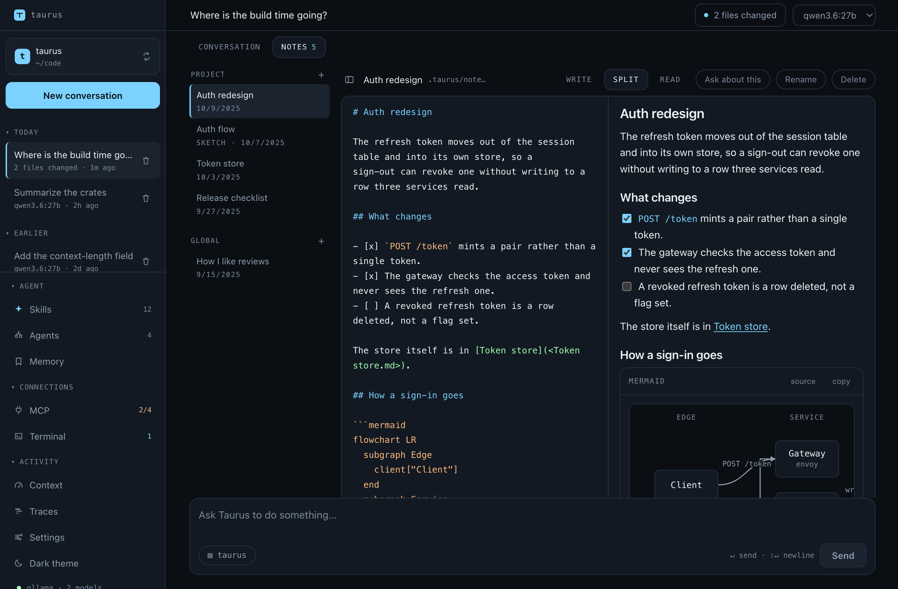
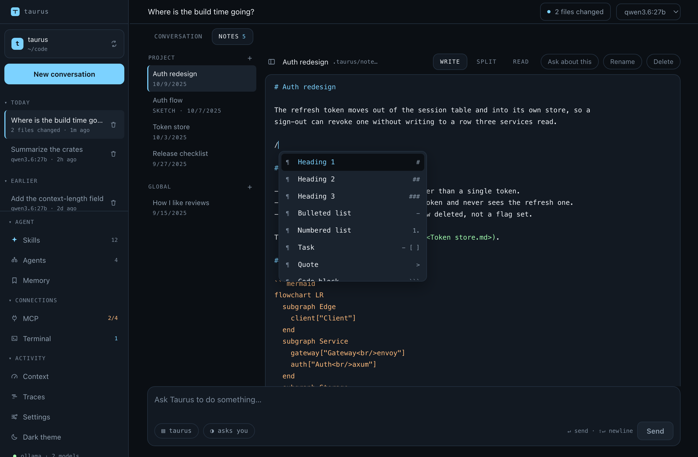
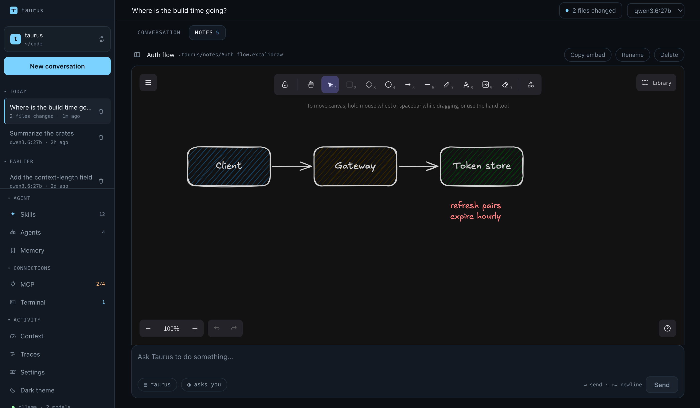
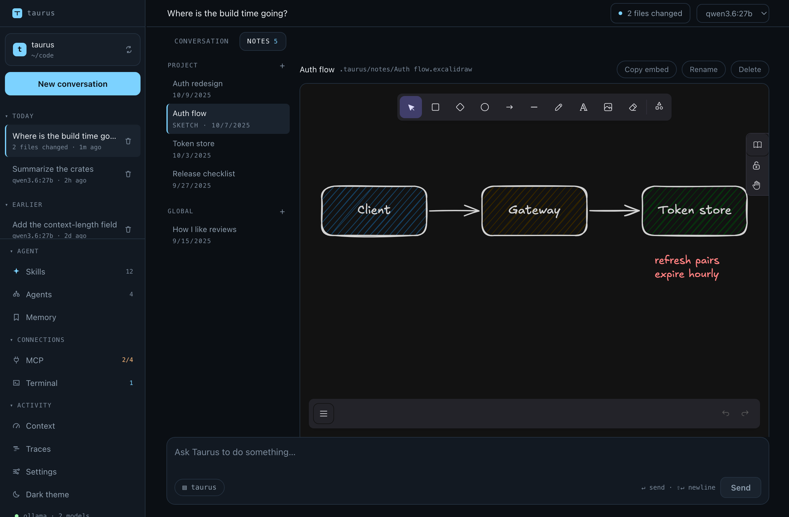
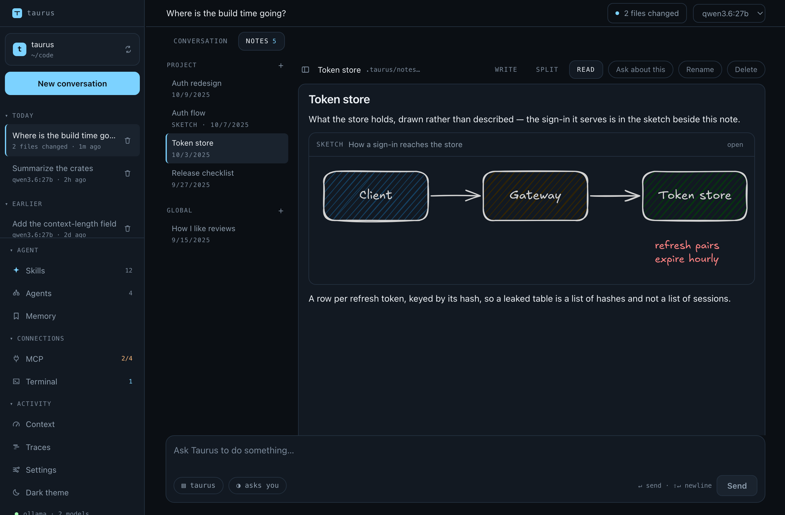
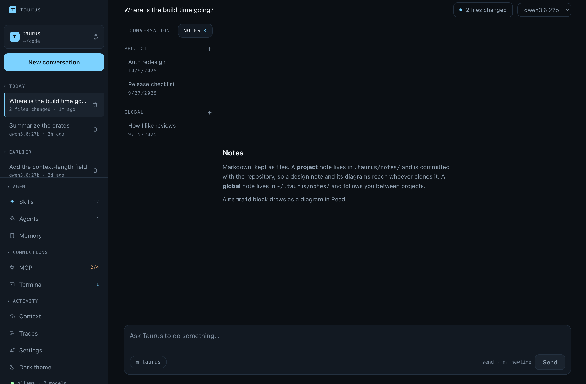
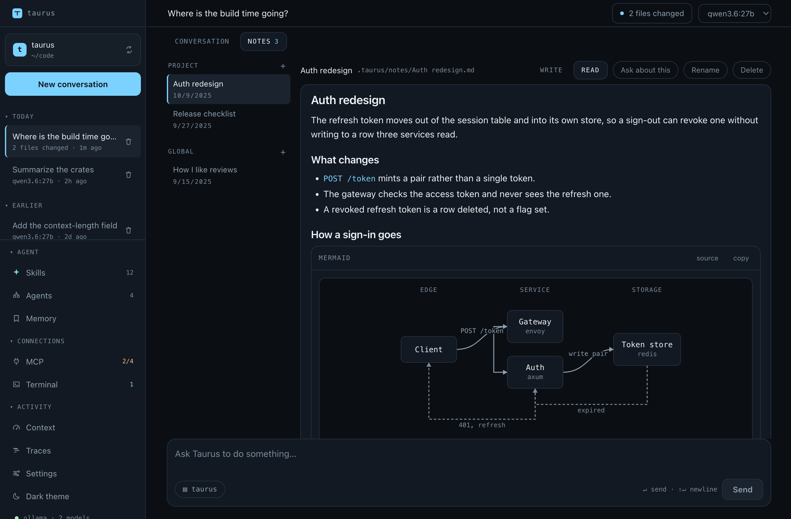

# Working with it

<sub>[← Taurus AI Shell](../README.md)</sub>

What a turn looks like in use: where the transcript lives, how a long task
gets planned, what you can hand it besides text, and how it decides when to
stop.

## Sessions

Every conversation is saved as it happens, so closing the app or the terminal
doesn't end it:

```bash
taurus sessions                       # this workspace's, newest first
taurus repl --resume                  # pick up the most recent one
taurus run --resume <ID> "and now…"   # continue a named one
```

The desktop app reopens the workspace's last conversation on launch. The left
rail lists the rest, today's first, so switching is one click, not a drawer.

Switching doesn't stop the turn you're leaving. A conversation mid-turn keeps
working: it keeps calling tools, keeps writing its transcript, and keeps the
files it changes on its own undo history. The rail says `working…` under every
conversation that's running, and going back to one picks the turn up where it
is — the part already recorded from its transcript, the round in progress from
the harness. The working line in the transcript counts up, so you can see how
long it's been going.

Stop is the only thing that ends a turn early. Leaving a conversation, opening
another, starting a new one, reloading the window: none of them stop anything.

What does stop a turn you've walked away from is being asked something. A
permission prompt or a question card waits for you, which is right when you're
there — the turn keeps its place, and answering hours later carries on from
exactly where it stopped — and wrong when you're not. The pill beside Stop
says which it is. Set it to **unattended** and anything needing a decision is
refused instead of waiting, and a question card is skipped: the turn spends the
night working and tells you in the morning what it couldn't do.

It never allows anything extra. Whatever a standing grant already covers
doesn't reach a prompt at all, so the only calls this changes are the ones
you'd have been asked about, and the only answer it gives them is no. The way
to let a long run do more is to grant it while you're there — **Allow always**
on the prompt — and then leave. It isn't saved either: the conversation asks
again tomorrow.

A prompt from a conversation that isn't the one on screen says whose it is,
since a turn you left running can be the one asking.

You can switch model or backend and keep the conversation. Pick another from
the topbar and the transcript comes with it. That's the point: you usually
want a second opinion on the question you just asked. A line marks the switch
in the transcript. The change is saved, so reopening the conversation later
continues on the model it was last used with, not the one it was opened with.

None of this needs translating. A transcript holds blocks, not any provider's
wire format. Each backend renders them into its own format, drops reasoning
it can't replay, and rewrites tool calls as plain text for a model without
native tool support.

What changes is what the model can do. The budget is recomputed every turn
from the current model, so a smaller context window compacts on the next turn.
A model that can't read images gets each picture replaced by a line saying one
was there. The images stay in the session and transcript, so switching to a
model that can see brings them back.

You can't switch mid-turn. A turn reads the model from the session on every
attempt, so switching would send half an answer to one backend and half to
another.

A conversation belongs to the folder you started it in, so changing folders
is a move, not a setting. Its transcript is filed under that workspace, its
checkpoints are keyed by it, and every path it mentions describes that tree.

Picking a new workspace closes the conversation on screen and opens what the
new folder has, as launching there would: its most recent conversation, or a
fresh one on the provider and model last used there. The one you left is in
its own folder's rail, and reopening it there picks up where it stopped. A
turn sent to a conversation from another folder is refused. The backend
enforces that, not the window.

You can't change folders mid-turn either. The move restarts every MCP server
the new folder configures differently, so the turn's tools could start failing
mid-call. Servers it leaves the same keep running. Stop the turn first —
any turn, in any conversation, not only the one on screen. The rail's workspace
button says so while something is running.

A conversation shows up in the rail as soon as you ask the first question,
not when the answer arrives. A two-minute turn is listed, with its name, the
whole time, and a crash mid-turn leaves your question behind. Opening a
conversation and changing your mind, or trying three models before asking
anything, leaves nothing.

A conversation is named after your first question, which fits for as long as
it stays on that topic. Click the name in the topbar to change it: Enter or
clicking away saves, Escape discards, and an empty field restores the derived
name. The name lives in the transcript's header, so it travels with the
conversation and survives being copied out. You can rename mid-turn, since
that touches nothing the turn is writing.

Closing the window still ends everything. A turn lives in the app's process,
so quitting stops it where it is. The conversation survives, because the
transcript is written as the turn goes, and reopening it offers to continue.
See [Picking up a turn Taurus stopped in](#picking-up-a-turn-taurus-stopped-in).

Transcripts live in `~/.taurus/sessions/<workspace>/<id>.jsonl`, in the
global config home, not the project. They hold file contents, command output,
and MCP responses, which would get committed by accident inside the workspace.
Keying the directory by workspace still gives you "this project's sessions"
without putting any of it in the repository.

The file is append-only, one JSON object per line: a header, then each
message as it's produced. Nothing is rewritten, so a crash costs the turn in
flight, not the conversation. A half-written last line is dropped on load
instead of poisoning the file. There's no index. A listing reads each
transcript's opening lines, and an index would be a second copy of the truth
that could disagree with it.

Renaming is the one exception, and it keeps the same promise. The name has to
live in the header, because a listing reads the top of the file and stops. At
the end of a long conversation, no screen would ever see it.

So a rename writes a complete new file beside the old one and moves it into
place. Until then the original is untouched, and the move either happens or
doesn't. Every line but the header is copied byte for byte. A record from a
newer version survives a rename by an older one, and a torn last line stays
exactly as torn.

The header records the workspace, the model the conversation *started* on,
and the checked-out branch. See [Conversations know their branch](safety.md#conversations-know-their-branch).
The branch field defaults instead of being required, because older
transcripts don't have it and an upgrade mustn't make them unlistable.

## Finding a conversation

The rail lists this workspace's conversations, today's first. That answers
"which of these was I in this morning" and nothing else. With sixty of them,
the question becomes "which one was that", and the answer is in a transcript,
not a title.

**⌘K** (Ctrl+K away from a Mac) opens one box over the whole window. Type,
and three kinds of answer appear under it:

- **Do** and **Panels**: every drawer, plus the handful of verbs that aren't
  in one. Matched on the name and on the words you'd reach for instead:
  `undo` finds Changes, `tokens` finds Context.
- **Conversations**: matched on title, from the list the rail already holds.
  No disk access, so it answers before your second keystroke lands.
- **In conversations**: the transcripts themselves, with the line the hit is
  on and the matching words marked in it.

The groups always come in that order. They're never mixed by score. The
first two are instant, and the third takes as long as reading the files
does. If a slow result could outrank a fast one, the row under your cursor
would move just as you pressed Enter.

Pick a conversation found by content and it opens **at the hit**. The turn is
marked and scrolled into view, instead of opening at the bottom as a resume
does. The mark clears after a few seconds, or when you ask something.

`everywhere` widens the search past this workspace, for the other question:
not "which conversation was that" but "which *project* was that in".


### What it searches

Prose: what you typed and what the model wrote back. Not tool calls or their
results, which is the whole difference from a `grep` of your home directory.
Tool results are file contents and build logs. They'd match nearly every
conversation for nearly every query and rank them by nothing.

A reasoning model's thinking is left out too. It mentions everything the
model considered, including what it rejected, so a hit there isn't evidence
the conversation was about that.

The match is literal and case-insensitive. There's no regex and no index:
every transcript in scope is read on every search. That's affordable because
transcripts are JSONL. If a file's bytes don't contain the query, the parsed
file can't either, so a conversation that doesn't match costs one file read.
Sixty conversations take about a tenth of a second. That's why the search is
debounced and fills in under answers already on screen.

See it on your own history:

```bash
cargo run -p taurus-host --example search -- "the thing you said"
```

## Planning a long task

A frontier model keeps a six-step task in its head. A 9B model doesn't, and
not because it forgot the steps. They're still there, twenty messages back,
behind a wall of tool output, competing with everything else for attention.

So `update_plan` writes a checklist that doesn't stay in the history. It's
rebuilt onto the **end of every request**, the last thing the model reads
before deciding what to do next. It goes on the copy being sent, never into
the stored conversation:

```
# Your current plan

You wrote this with update_plan. It is restated here every time because it is
the record of where you are:

1. [x] Change the greeting in main.rs
2. [>] Add version to config.toml
3. [ ] Compile and confirm it prints hello

Call update_plan again the moment a step's state changes — send the whole list
back with the states updated. Work the step marked [>], and do not start
another until it is [x]. Closing the last step is a call to update_plan, not a
sentence in your reply: when the work is done, send the whole list back with
every step 'done' first, and then say what you did and stop.
```

The same list is on screen, so you're reading what the model is reading.

**Why the end, and not the system prompt.** The end of the system prompt
feels like the end of something, but it's the very start of a request, ahead
of the tool schemas and every message.

A backend reuses the longest identical prefix of a prompt it has already
processed. `update_plan` is called at the start and end of every step, so a
plan up there throws away the tools and the whole conversation each time a
checkbox moves:

- On one local 30B, a 9,550-token prompt cost 16ms to repeat unchanged and
  10,933ms to repeat with a single line of the plan edited.
- The same three-step task ran in 75 seconds with the plan at the end and 194
  seconds with it at the front.
- On Anthropic it's the same fact with a price on it. The cache breakpoint
  sits on the system field and covers the tools rendered before it, so a
  moved plan misses both.

At the tail, the plan invalidates only itself, and it sits nearer the model's
attention.

Four properties do the work, and each one has a test:

- **The whole list, every time.** No step id to quote back, and no
  add/complete/remove protocol to get half right. A small model can't reach a
  state it didn't write out. And since the payload is the model's own input, a
  reopened conversation redraws the plan without recomputing anything.
  `show_table` and `ask_user` rely on the same identity.
- **One step in progress.** More is refused, naming which. A checklist with
  three active steps can't say where the turn is, and that's its one job.
- **States only move forward.** A done step that comes back as `todo` or
  `active` is refused, and so is a finished step below an unfinished one. Both
  mean the model lost its place. The list is replaced wholesale and a missing
  state reads as `todo`, so a re-typed list without states would otherwise
  silently undo every finished step.
- **Nothing when there's no plan.** Not an empty section: nothing. A standing
  instruction to keep a checklist is how a two-step turn grows a six-step
  plan.

It's rebuilt, not appended, for the same reason it isn't a message. Copies
pushed every iteration would pile up, each staler than the last, and the
model would have to work out which of nine is current.

**The checklist is pinned above the composer, not drawn in the transcript.**
It's not an event. It's where the work is *now*. In the transcript it would
scroll away behind the twenty tool calls it organizes, and you'd have to hunt
for the panel that answers "where are we". Pinned, it's on screen whenever
anyone asks.

It's one line by default (a bar, the live step, a count) and opens to the full
list on a click. The transcript is the window's whole point, and a seven-step
list nailed across it would spend a third of the reading area saying what
30px says. Once opened, it stays open. The model rewriting the plan isn't a
reason to close it on someone watching the steps.

Only the newest plan is pinned. The model rewrites the whole list whenever a
step starts or finishes, so a six-step task ends with seven calls. Each keeps
its row in the run header, and only the last has a checklist to show. A
finished plan stays up until you ask for something else. "Done" is worth
seeing, but last hour's checklist over an unrelated question isn't. An
unfinished one stays regardless, which is most of the point.

**An unfinished plan survives into the next message**, in the prompt and on
screen. It has to. A six-step task is often six steps with a question in the
middle. If the checklist vanished when you answered "yes, go on", the model
would rebuild it from memory: the very drift the plan exists to stop, one turn
later.

A *finished* plan doesn't survive. All steps `[x]` means the work is over.
Restating it would tell a model asked about something else that its standing
instruction is "say what you did and stop". The panel follows the same
staleness rule on purpose. What you read above the composer and what the model
reads are the same checklist, and they'd be worse than useless if they
disagreed about whether it's live.

A carried plan is labeled as carried. The model is told the steps predate
the message it's answering, and to call `update_plan` with a new list if the
request has moved on. Only the model has read your follow-up, so only it can
decide whether the task continues or changes. The harness honestly declines to
guess. Rewinding a turn drops the plan, like the files: it was working state
for work that's been undone.

**Whether a model reaches for it is the model's own judgment.** On a
five-step mechanical task, `qwen3.6:27b` and `qwen3.5:9b` both did the work
correctly and never called it. Asked to plan, the 27B kept the list accurate
through every step. The prompt says when to plan and when to update, and
that's all the harness can do. See [Known gaps](known-gaps.md).

## Showing it a picture

Every provider adapter here *sends* an image without loss.
`ContentBlock::Image` maps onto Ollama's `images` array, OpenAI's `image_url`,
Anthropic's `source`, and Gemini's `inline_data`. Getting one in is the
composer's half: paste or drop it there.

```
┌──────────────────────────────────────────┐
│  [thumb] [thumb] ✕                       │
│  why is this layout wrong?               │
│  ▤ taurus-ai-shell   ↵ send · paste an image │
└──────────────────────────────────────────┘
```

Both are refused outright on a model that can't see, instead of failing a
round trip later. The check is per *model*, not per provider. On one Ollama
server `gemma4:12b` reads images and `llama3.2` doesn't, and the composer only
offers paste when the session's model reports vision.

Everything else checkable is checked before the turn starts. A provider that
rejects an image returns a wire error naming a request body field, the least
useful thing to hand someone holding a screenshot. So:

- **The format is one every backend takes**: PNG, JPEG, WebP, GIF. The
  intersection, not the union. Gemini would take HEIC and Anthropic wouldn't,
  and a format that breaks the day you switch provider is worse than one that
  never worked.
- **The bytes really are that format.** Clipboard flavours and file
  extensions are wrong often enough that the magic number is checked against
  the claim. A `.png` that's really a JPEG is named here, not on the wire.
- **Four at most, five megabytes each.** Each image is budgeted at a flat 1000
  tokens, since its real cost has nothing to do with its base64 length. This
  harness is built for 8k windows, and four images are already half of one.

Images go before the text, the order the model reads them and the transcript
draws them. A reopened conversation rebuilds the strip from the transcript's
`image` blocks, so the screenshot stays beside its question.

### A tool can hand one back

The other direction: a tool's answer is a list of blocks, not a string. A tool
that took a screenshot, rendered a chart, or rasterized a PDF page can return
the picture itself:

```
mcp__playwright__screenshot  https://example.com

  ✓ the page as rendered
  [thumb]
```

The blocks are text, image, and JSON, and the tool says which it means.
Nothing is guessed. Text that looks like JSON stays text, so a `read_file` on
a `.json` returns JSON-shaped prose. Output that changed shape with the file
would be worse than output that's never structured.

**MCP servers get this for free, and they're the reason for it.** Their
screenshots arrive as pictures, not the literal words `[image: image/png]`,
which is all a result type with no room for an image can say.

**Only Anthropic carries an image inside the result.** OpenAI's
`role: "tool"` message, Gemini's `functionResponse`, and Ollama's tool message
are text-only. There the image follows the result, with a line naming the
call: as its own user message on OpenAI and Ollama, and as further parts of
the same content on Gemini. The result keeps a marker where the picture was,
so a tool that returned a sentence and a chart doesn't seem to have returned
only the sentence.

**On a model that can't see, an image becomes a line saying so.** Dropping it
would make a working tool look broken, when really it worked and this model
can't look at the answer.

Tool images get the same checks as pasted ones: the four formats, the magic
number against the declared type, the five-megabyte cap. A buggy built-in and
an MCP server nobody here wrote can both produce something no provider will
take. A failing image is replaced by a line naming the tool and the reason,
which is what the model needs to decide whether to call it differently.

## Finding code by what it does

`grep` answers *where does this string appear*. On an unfamiliar repository
you want *where is the code that does this*, and grep can only answer that if
you already know what the thing is called.

An embedding index is usually a cloud dependency: a service to send your code
to, a bill, and a vector database to run. For a local-first harness it's none
of those. The machine already runs a model server, so the index is one more
endpoint on it and the vectors are a file in the config home.

```
search_code  "where the conversation transcript is written to disk"

  0.677  crates/taurus-host/src/sessions.rs:121-160
  0.635  src/state/store.ts:61-100
  0.593  scripts/screenshots/fixtures.ts:1-40
```

Those are real results from this repository, and the first is right. It
matters most at 8k, the size everything here is shaped around. A context that
small can't afford three wrong `read_file` calls, each a page of tokens spent
on a file that wasn't the answer.

**It refreshes before it searches, not on a timer.** A model that just wrote
a file has to be able to find it. An index refreshed on a schedule would
answer from before the edit, which is worse than no index because the answer
looks right. Only files whose length or modification time moved are re-read,
the same comparison `make` and `rsync` use. On this repository:

```
first pass:    110.3s  Indexed 405 files (6116 chunks)
second pass:  127.2ms  Index is current: 405 files, nothing to re-read
               6116 passages, 24.7 MB on disk
```

**The first pass starts with the message, not with the search.** Nearly two
minutes is a long time to sit in a tool call, and that's where it would go if
the model reached for `search_code` on an unindexed workspace.

Instead, sending a message starts the refresh in the background, so the first
search lands on an index that's been building since. If it lands early, the
tool takes over the refresh and finishes it with a progress bar in the
transcript. Everything already embedded is written down, so taking over costs
seconds, not a restart.

Nothing indexes a repository just because you opened it. Indexing needs an
embedding model configured, the same switch that decides whether
`search_code` exists.

That's also what makes **Settings → Search → Build index now** safe to stop. A
stopped build keeps everything up to the last write, and the next one carries
on from there. A file is never written half embedded. Files count as current
by their first chunk's stamp, so a half-embedded file would report up to date
while the rest never arrived.

Three deliberate simplicities:

- **Line windows, not syntax.** Forty lines with ten of overlap, in every
  language. The overlap keeps seams from being blind spots. Without it, a
  function split across a boundary is half in each chunk and whole in neither.

  That's argued from a number. Cutting at structure instead (snapping each cut
  to the nearest line that starts a new top-level thing, by indentation, with
  no grammar) was built and measured against it on fifteen questions. It
  retrieved *worse*: MRR 0.60 against 0.67, and the answering file first for
  40% of questions against 53%. Embedding a heading with each chunk, so a
  window from the middle of a long `impl` carries the signature above it, was
  worse again at 0.57. Neither shipped. See [Known gaps](known-gaps.md) for
  what that does and doesn't settle, and run
  `cargo run -p taurus-index --example retrieval` to repeat it.
- **A loop over every vector, not an ANN index.** Twenty thousand vectors of
  768 dimensions is fifteen million multiply-adds: under a millisecond, and
  dwarfed by the round trip to embed the query. An approximate structure would
  buy nothing measurable and add a way to be subtly wrong. *Nearly* right
  answers are far harder to notice than none.
- **One hit per file.** A query that matches a file usually matches three
  consecutive chunks of it, and three windows of one function are a worse
  answer than three places to look.

The index lives in `~/.taurus/index/<workspace>/`, beside the transcripts and
checkpoints, keyed the same way for the same reason: it holds the contents of
project files. Only its owner can read it.

Unlike the sweep, it respects ignore rules for *files* as well as
directories. The sweep looks past an ignored `.env` because that's exactly the
file you'd want to undo. But the model searches the index, and showing it
secrets is the opposite of what anyone wants. `.taurus` is excluded too, so a
search over the project can't return the conversation about the project.

## While a turn runs

You can keep typing during a turn. Enter holds your message instead of
sending it: one message, shown above the box, sent as its own turn when the
current one finishes. Thinking up the next thing while the model works is most
of how this gets used. Otherwise Enter would seem to do nothing.

Only one message is held. A queue of three is a conversation nobody's having,
and the box can't show or reorder one, so a second message replaces the
first. The ✕ beside it throws it away.

A held message sends itself **only after a turn that ran to the end**:

- Press Stop and it stays. Watching it fire anyway would be the opposite of
  what the button said.
- If the turn died, it stays too. Whatever broke is still broken a millisecond
  later, and an automatic resend would spend the rate limit instead of
  reporting it.

Either way, the row says it didn't go and offers to send it by hand.

Scrolling up stops the transcript following the stream. A pill at the bottom
takes you back to the live edge, so reading three tool calls back isn't a
one-way trip.

A run of tool calls shows its steps while its turn is the newest, and folds
to a one-line heading once you ask something newer. That's how a fifty-turn
conversation reads as fifty steps, not four hundred calls. Two exceptions:

- A failed run stays open wherever it ends up. The heading says a step failed,
  not which.
- A run you opened or closed by hand stays that way. A panel that reopens on
  its own is the app arguing with your click.

### When it needs you

A turn stops dead at three things it can't decide: a permission, a question
card, and a proposed skill or sub-agent. On a local model that can be minutes
into a turn you've walked away from. So the app tells the desktop, not just
its own window: a dock badge counting what's owed, and one bounce when the
count rises.

Both are suppressed while the window has focus, since everything the badge
could say is already on screen, in color, three inches from the pointer. The
bounce fires when something new arrives while you're away, not when you leave
with something pending. Alt-tabbing away from a permission dialog isn't news
about it. A turn that finishes unwatched counts as one thing owed, and coming
back clears it.

Windows gets no badge. It has no taskbar badge count, and the documented
substitute, an overlay icon, means shipping a rendered image per number. The
taskbar flash carries the signal there. On Linux the badge needs a desktop
with `libunity`, and is quietly dropped without one.

### Asking something again

Every question in the transcript has an **Edit** on hover that puts it back
in the box to change and ask again. It's added to whatever's already there,
not swapped in, the same rule every other offered sentence follows.

It doesn't rewrite the transcript, on purpose. The transcript records what
was actually asked and answered. Editing a question the model already read
would make it record something that didn't happen. To get the *files* back,
see [Rewinding a turn](safety.md#rewinding-a-turn).

A turn that died has **Try again** on the failure. It resends the same
message with its images and the pane it was asked from, since dropping those
would ask a different question.

It's a resend, not a resume: the harness can't pick a turn up partway. If the
first attempt wrote files before it broke, both turns are in the checkpoint
log and either can be rewound. Merging them would give you a rewind that
undid twice what its label said.

### Picking up a turn Taurus stopped in

A turn that was running when Taurus quit, crashed, or the machine slept is
recorded as started and never finished. Reopening the conversation says so
above the composer: "This turn stopped when Taurus did," and how many calls
were running. Those calls show as failed, with "outcome unknown", because
nothing reported what they did.

**Continue** starts a new turn that says "Your previous run was interrupted.
Continue from where you left off." Nothing is replayed. The model reads the
history, including a note on each unknown call saying what to check (the path
a file tool named, the command a shell call ran), and decides what's left.

It's always a click. A conversation reopened days later is one to read before
anything runs in it again, so continuing never happens on its own.

One request gets three turns in all: the one that was interrupted and two
continuations. They're counted from the transcript, so restarting Taurus
doesn't reset them. After that the strip stays but the button goes, and a
message you type picks it up instead. A typed message is a new request, and it
carries the unknown outcomes with it just as Continue does.

The CLI does the same: resuming an interrupted conversation says so, and
`/continue` picks it up. A CLI turn is now written down as it runs, round by
round, instead of all at once when it ends.

## When a turn stops

A turn runs until the model stops asking for tools. Three things end one
early. Each records its reason in the transcript, so a resumed session finds
an explanation, not a conversation that just stops:

- **The iteration ceiling**: twenty-five model/tool round trips by default.
  It's a ceiling, not a budget shown to the model, because a limit the model
  can see is one it can argue with.

  Set it in **Settings → Behavior**, or as `max_iterations` in
  `settings.json`, between 1 and 100. Raise it for long refactors that need
  more rounds. Lower it to catch a model going in circles sooner. It's read
  every turn, so a change applies to the next message, not the next launch.
  It layers like the rest of that file, so one project can raise it without
  loosening it everywhere.

  A hundred is the hard ceiling, the same one a sub-agent's `max_iterations`
  is validated against. A larger number is clamped, not refused, because a
  settings file that won't load is a worse answer to a typo than a number
  brought back into range.

  This is the *conversation's* limit. A sub-agent has its own, and a delegate
  with thirty rounds spends one of the parent's, not thirty. Each agent's
  limit is on its card in the Agents drawer, which also shows this number so
  you can compare them in one place.
- **A stall**: the same tool failing with the same error three times, with
  nothing succeeding in between. The count goes by the error the model got
  back, not the arguments it sent. A model retrying a refused call rarely
  sends identical JSON: it reorders a key or rewords a field the tool
  ignores, and still gets the same answer. The system prompt tells the model
  not to retry a failed call unchanged, and this enforces it. Failures count
  across rounds, not just back to back, so alternating between two dead ends
  (A, B, A, B, A) is caught as readily as repeating one. Any success clears
  the count, so a model working through genuinely different candidates
  doesn't trip it. Re-reading a file it's editing is working, not stuck.
- **A provider failure no retry could fix**: a rejected key, an unknown model,
  a response that wouldn't parse.

Rate limits and 5xx errors aren't in that last group. They're retried up to
three times with a doubling backoff, and the wait is reported, because an
unexplained pause looks like a hang. When the backend says how long to wait
(a `Retry-After` header, or the `RetryInfo` Gemini puts in its error body),
the wait is that or the backoff, whichever is longer, and the notice says so.

A backend asking for more than two minutes has run out of quota, not hit a
blip. That failure surfaces with its number instead of holding the turn.
Canceling during a backoff returns immediately.

A backend that goes quiet is given up on, not waited for:

- A connection has 30 seconds to open.
- A response has ten minutes to send its next byte. That's longer than a
  reasoning model thinks before its first token, or a local model takes over
  a long prompt.
- TCP keepalive finds a peer that's vanished outright, like a laptop that
  changed networks, in about two minutes.

A stall is retried like a 5xx if nothing had reached the screen yet. The
notice names the backend and the wait, so it doesn't read as a network
problem.

One case is deliberately never retried: a request that had already started
streaming. You've read the first half, and a retry would write it again.

### One thing extends a turn

A turn that changed files and never ran anything afterwards is asked, once,
to check its work before it can finish:

> You changed files and have not run anything since. Check that work now — run
> the project's tests, or build it, or run the thing you changed. If there is
> genuinely nothing to run against it, say so in one line and stop.

The system prompt says the same thing, but that isn't enough: a 9B model
edits a file and stops anyway. Asked when it tries to finish, it goes and runs
the build.

Checking means a command that ran with nothing written after it: the model
asked the project a question and got an answer, with no edit since. Order
decides, and it's the order the calls ran. Calls that only read run first,
side by side. A delegation counts as one of those only when its agent can't
write. Everything else runs one at a time, in the order the message
lists it. So a round that ran the tests and then edited still owes a check,
as if the edit had come in its own round. A write listed before a
`check_command` still lands after it.

The word doing the work is *since*. Picture a rule that treated any round
that wrote anything as leaving the debt standing, on the theory that a command
which writes is doing work, not asking a question. It can't see the case where
the write *was* the check.

A test runner leaves a `.coverage` beside the code, and a file an ignore rule
excludes is one the sweep looks past on purpose. So the run would read as
work, and the model would be told it hadn't run anything, one line after
reporting the tests passing.

One case is ambiguous and always will be: a `make` that builds and formats,
or a test run that updates its own snapshots, clears the debt. Nothing in a
shell command tells those apart from a test runner writing a stamp. A nudge
that fires wrongly costs a round trip and says something false. One that
stays quiet just leaves a backstop unused.

It fires once per turn, with a way out, so a documentation edit costs one
round trip, not an argument. `verify_changes` in `AgentConfig` turns it off.
It reads the checkpoint log to tell whether anything changed, so it's exactly
as accurate as the log. A command that only touched files in an ignored
directory reads as having changed nothing.

## The context window

A local 8k model runs out of room in a way a hosted 200k one doesn't, so the
budget is managed, not hoped for. Three things do the work, and one thing
decides when they run.

**The budget is measured against the whole request, and learns what one
really costs.** Only the messages can be shrunk. But counting only them would
let the system prompt, every tool schema, and the appended plan ride along
unmeasured, with the threshold quietly paying for them. Those costs scale with
a workspace's configuration, the headroom is a fraction of the window, and on
a small window the two cross. The nine built-in tools are about 1,650 tokens
before any message.

So the fixed part is estimated from the text it's made of, and what a request
really cost is spent correcting the *messages* instead. A response reports the
whole prompt's size as the backend counted it: its tokenizer, its envelope,
its rendering of the tools, cache hits included. Take the fixed part off that
and what's left is what the messages really cost, so the ratio between it and
the estimate for the same messages is how far four characters a token is off
here. Every later estimate is scaled by it, which is self-correcting per
provider and per conversation.

Keeping the two apart is what makes the harder question answerable. "Does the
whole prompt fit" comes out right either way, because the drift is added back
to a conversation about the size it was measured on. "Would the recent
messages fit on their own, once everything older is summarized" doesn't:
charging a whole conversation's worth of drift to the eight messages that
can't be summarized makes a turn with plenty of room report a window too small
for its own recent history, and stop.

A reported zero is ignored. A canceled stream, or a gateway that strips the
field, would otherwise say the whole prompt cost nothing.

**It's on screen while it fills.** Above the box, from half a window on, you
see what fraction is used and what it's a fraction *of*. The second number
matters more. An OpenAI-compatible endpoint can't be asked how much a model
holds (`/v1/models` returns ids and nothing else), so the figure may be the
built-in 128,000 assumption. A conversation that fills implausibly fast is a
misconfiguration nobody can spot unless the number is shown. Set
`context_length` for the model in
[`providers.json`](configuration.md#azure-openai-and-gateways-in-front-of-it)
and the meter tells the truth.

**What's held back is the answer, not a fraction.** The budget is the window
minus what the reply needs. The reply is what has to fit beside the history,
and its size depends on the request, not the window.

A flat fraction gets this wrong at both ends. Eighty percent of an 8k window
leaves 1,600 tokens for a reply capped at 32,000: the history fits, then the
answer doesn't. Eighty percent of a million leaves 200,000 tokens of history
unusable, protecting an answer that will never come near needing them.

So the reserve is `max_tokens` where a turn sets one and 32,000 where it
doesn't, held between a twentieth and a quarter of the window. A local model
can't give up 32,000 tokens it doesn't have, and on a large window a twentieth
is the margin between four-characters-a-token and a real tokenizer. A
200,000-token model gets 168,000 tokens of history where a flat threshold
would give 160,000. A million-token model gets 950,000 instead of 800,000.

**And it either makes room or says why it can't.** The verbatim tail is
bounded by tokens as well as message count. Eight recent messages can be
eight large tool results, and a tail bigger than the budget makes summarizing
achieve nothing, once per iteration. Where no boundary helps, it says so once.
Either the recent messages are too large on their own, or the system prompt
and tool schemas fill the window alone. That second case is a model too small
for this agent, not a conversation that grew.

**Reads come back a window at a time.** On a 200,000-token model, `read_file`
returns 2000 lines by default and takes `offset` and `limit` for the rest.
Line numbers stay absolute, so they still mean what they say in a windowed
read. A partial answer always says so. An unannounced window looks like a
short file, and a model that thinks it read everything will act on what's
missing.

There's a second cap, 256 KB on the same model, on the *answer*, not the
file. The window is taken around the requested offset, so a line near the end
of a ten-megabyte log opens as cheaply as one near the start. Only a window
too large to return is cut, and it says where to pick up. If every read began
at the first byte instead, a file past the cap would have a tail nothing could
reach, and a line number from `grep` would be one the model couldn't look at.

**Every one of those caps is a share of the window, not a number.** The sizes
above are for a 200,000-token model, the anchor, and one size can't be right
twice. 64 KB of command output is about sixteen thousand tokens. That's twice
what an 8k local model holds, so the answer overflows its own request. On a
million-token window it's under two percent, and the model pages back through
output it could have had at once.

So each cap is anchored at 200,000 and scales with the turn's model. An 8k
model reads 200 lines of a file and 4 KB of a build log; a million-token model
reads 10,000 lines and 320 KB. Where the window isn't knowable (an
OpenAI-compatible endpoint that never declared one, or a tool run outside a
session), every cap is exactly its anchor value, so nothing that can't ask a
model its size gets a different answer.

Floors and ceilings bound the scaling. Below the floor, a cap stops bounding
output and starts destroying it. Above the ceiling, a single tool result is a
different problem from a budget.

**Old tool output shrinks before anything is summarized.** Tool results are
most of what a working session holds, and every byte is re-sent on each
iteration. When history crosses the compaction threshold, two cheap rules run
first, with no model call:

- A result whose call was later repeated with the same input is cut down to a
  pointer at the newer one.
- Results older than the verbatim tail keep their first few lines and say
  what went.

Only if that doesn't get under budget is the older half summarized. The
block itself always stays. Replacing its text keeps every tool call paired
with a result, which is what providers actually validate.

The summary is asked for as four fields — the goal, what's settled, the files
touched, and what's still outstanding — and on Ollama the schema is sent as
the `format` the answer is sampled against, so the model can't emit anything
that leaves a field out. The last field is why. A summary that quietly drops
what's left to do doesn't read as wrong; the turn resumes from it, decides
it's finished, and stops. Backends that can't enforce a schema answer in prose
and that prose is used as it stands, so this improves the summary where it's
supported and never gates it.

**Nothing is advertised that the prompt can't explain.** Every tool schema
goes out on every iteration of every turn, not once per session, so it's the
one part of the prompt that's pure overhead. Three things keep it down.

Schemas are slimmed on the way out: `$schema`, the Rust struct name
`schemars` leaves in `title`, `"default": null`, and integer-width formats are
dropped. That's about a quarter of the built-in schema bytes, and MCP servers'
schemas get it too.

`propose_skill` and `propose_agent`, the largest schemas here, are each
registered only when their own setting is on, matching the prompt section that
explains each. Offering one unexplained would pay for a tool the model has no
reason to call. And a project can name anything it doesn't want in
`settings.json`:

```json
{ "disabled_tools": ["fetch_url", "mcp__some-server__rarely_used"] }
```

A disabled tool isn't registered at all, so skills and sub-agents can't reach
it either. A tool hidden from the model but still callable would be a
permission gap posing as a token saving. A name matching nothing is reported,
because otherwise a typo looks exactly like a tool that's quietly still on.

You can also name eight tools a turn adds for itself, though `taurus tools`
doesn't list them. It prints what a *sub-agent* could be scoped to, and these
eight are exactly the ones a sub-agent never gets:

- `spawn_subagent`, which is the delegation depth cap;
- `show_table`, `show_chart`, `show_sequence`, `show_flow`, `ask_user`, and
  `open_file`, which address the person watching this conversation;
- `update_plan`, whose checklist belongs to the turn that wrote it.

**And when it fills anyway, you can find out what filled it.** The meter
says how much; pressing it says on what. The Context panel is also in the
rail, since the meter hides below half a window. It covers one conversation
or every conversation in the workspace: turns and messages, what the provider
billed and how much came from cache, what the transcript holds now, and a row
per tool with its calls, tokens, and share.

Two numbers on it are worth acting on:

- **Repeated calls**: same tool, same input, twice. Pure waste, and the only
  thing here a differently worded question would have avoided.
- **Sent again with every request**: the system prompt plus every advertised
  tool schema. It's not in the transcript. It goes out on every iteration of
  every turn whether or not anything is called, and it's why a conversation
  worth a thousand tokens can bill twenty. The heaviest schemas are named,
  which tells you what to put in `disabled_tools`.

That half is read from the live configuration, not a transcript, so it
describes the *next* request. It's worth opening even where nothing has run
yet, and the panel says so instead of showing an empty frame.

Everything but the billed row is estimated at four characters a token and then
corrected by what this session's own requests revealed, since the provider
reports one number per request and never says which part of the prompt was
whose. The correction is one ratio across the session, so it moves every
figure together and leaves the shares exactly where they were. The same account prints in the terminal:


```bash
taurus usage              # the most recent conversation here
taurus usage --all        # every conversation in this workspace
```

**Semantic search is off until a model is named.** `search_code` needs
something to embed with, so it isn't registered until you set one under
**Settings → Search** or in `settings.json`, which is the same field:

```json
{ "embedding_model": "nomic-embed-text" }
```

By default it runs on the conversation's provider. In a local setup the
embedding model is on the same server as the chat model, and a second entry
naming the same machine would be one more thing to keep in step. Pull one
first (`ollama pull nomic-embed-text`). The index is keyed on the model name,
so changing it discards the index instead of mixing vectors that mean
different things. See [Finding code by what it
does](#finding-code-by-what-it-does).

**Name a provider when the conversation's can't embed.** Ollama, any
OpenAI-compatible server (llama.cpp, LM Studio, vLLM,
text-embeddings-inference, OpenAI itself), and Gemini all serve embeddings.
Anthropic has no embedding endpoint at all and points at Voyage AI instead.
So if you're chatting to Claude, name a second backend for the index instead
of switching the conversation:

```json
{
  "embedding_model": "text-embedding-3-small",
  "embedding_provider": "openai"
}
```

Leave the provider empty and it follows the conversation, which suits a local
setup. The field appears under **Settings → Search** once a model is named,
and the two save together. A model with no provider would embed on whatever
backend the conversation happened to be on, the very case this exists for.

**A reranker can be put in front of the results.** It's optional, off by
default, and a second stage, not a replacement:

```json
{ "rerank_model": "bge-reranker-v2-m3", "rerank_provider": "llamacpp" }
```

Embeddings score a query and a passage separately and compare the numbers.
That's what makes an index possible, since every vector is computed once and
kept, and it's also what caps its quality. A reranker reads the query and the
passage *together*: markedly better, and far too expensive to run over a whole
repository.

So the cosine pass draws up a shortlist of thirty, and the reranker picks
five. That's worth the extra round trip at 8k for the same reason the index
is: being wrong costs a `read_file` on a file that wasn't the answer.

`rerank_provider` is separate from the embedding provider because the common
local setup can't serve both: Ollama has no reranking route at all. A
llama.cpp server started with `--reranking` is the usual second entry, and
anything speaking the Cohere-shaped `/rerank` route works:
text-embeddings-inference, Jina, Voyage, Cohere itself. Leave it empty if one
server does everything, and it resolves to the one the index embeds on.

Scores aren't comparable across backends, and two things follow:

- Once a reranker has ordered the results, they say `relevance` instead of
  `similarity`. The number isn't a cosine any more, and on a local llama.cpp
  it's routinely negative. A passage scoring −4.75 may still be the best
  answer in the repository.
- Nothing is ever *filtered* by that number, only ordered by it.

Reranking never takes the search away. An unreachable server, an unpulled
model, or a backend with no such route leaves the similarity order standing
and says so in the log. The search works without this stage, and an accuracy
pass that could fail the whole tool mid-turn would cost far more than the
reordering is worth.

**The first index can be paid up front.** Embedding a repository can take
nearly two minutes. Left alone, that lands inside whichever turn first
calls `search_code`, as a tool call that doesn't return while it runs.
**Build index now**, beside the model field, does the same work outside any
conversation, with a bar you can watch and a Stop that stops indexing, not a
turn.

It's the same refresh a search runs, so nothing is duplicated: build it here
and the first `search_code` finds it current. Later refreshes are cheap
either way.

**Where it went is a question you can ask.**

```bash
taurus usage            # this workspace's most recent session, by tool
taurus usage --all      # every session in this workspace
```

```
Turns              1
Messages           16
Billed by provider 20,440 in / 496 out
Transcript holds   ~1,407 tokens

Tool                    calls    ~tokens   share
read_file                   7      1,144    100%

Sent again with every request  ~1,982 tokens
  system prompt                 430
  10 tool schemas             1,552

Heaviest tool schemas
  propose_skill                 456
  read_file                     166
  run_command                   160
  edit_file                     156
  run_skill_script              151
  5 more                        463
```

The gap between the first two figures is the point. A transcript holding
1,407 tokens billed 20,440, and the bottom half shows where it went: ~1,982
tokens of fixed overhead on each of seven requests.

Per-tool numbers are estimates, but they use the same arithmetic that drives
compaction, so the report and the trigger can't disagree. They're read back
from the transcript, not tracked beside it, for the reason the transcript
format gives: a second copy of the truth can disagree with it.

## Where the time went

The Context panel covers what a turn cost in tokens. **Traces**, beside it in
the rail, covers why it took as long as it did. The transcript can't tell you
that, because it records what was said, not how long anything took.

The source is OpenTelemetry. Taurus opens a span around every turn, model
request, and tool call, named the way the GenAI semantic conventions name
them. [Tracing a turn](configuration.md#tracing-a-turn) covers sending those
to a collector. This panel reads the same spans without one, from an
in-memory ring of the last few hundred finished spans. The ring goes nowhere,
holds no message content, and is gone when you quit.


The headline splits a turn's wall time into **model time** and **everything
else**: tools doing their own work, the harness between steps, and waiting.
That's the only safe split.

Model calls never nest, so summing them is exact. Tool calls do nest, because
a `spawn` holds a delegate's entire turn. Adding that tool's four seconds to
the four seconds that ran inside it would give a turn that spent 180% of
itself. The tool table has its own denominator for the same reason, and the
row containing a delegate says so.

Press a turn to open its waterfall: one bar per span, placed against the
turn's start and indented by depth. The indent tells a sub-agent's model call
from the turn's own, so a delegated turn reads as a tree, not a list you
reassemble by timestamp.

Each model and tool gets two figures, and neither is a percentile: the
**median** call and the **slowest**. A local ring holds tens or hundreds of
calls, not the millions a p95 needs to mean anything. Both are real calls,
and the slowest is usually the one you opened the panel to find.

Scope is the conversation or everything since launch. Unlike the usage
account, the wider scope can still answer about conversations you've closed,
because the ring outlives them.

A delegate's work counts toward the conversation that asked for it, not the
sub-agent's session. Otherwise narrowing to one conversation would leave the
`spawn` on screen with its contents gone. **Clear** empties the ring, so the
next reading covers only what you do next, not that plus the morning.

Know the limits before relying on it:

- It covers this run of the app, not this machine and not this week.
- A `taurus run` in the terminal is a different process and doesn't appear
  here.
- Once the ring is full, the panel says how many spans it has forgotten,
  instead of quietly covering a shorter period than it seems to.

Durable history across days and machines is what an OTLP endpoint is for.
Both can be on at once, fed the same spans.

## Output formatting

Models answer in markdown, so both frontends render it.

The app parses markdown progressively as tokens arrive, tolerating the
half-finished constructs streaming produces, like an unclosed `**` or an
unterminated code fence. Raw HTML is never rendered. Model output isn't
trusted markup, so `rehype-raw` is deliberately absent and tags arrive escaped
as visible text. Links open in your browser instead of navigating the webview
away from the app.

The CLI applies ANSI attributes line by line: headings bold, `•` for bullets,
colored inline code, dimmed fenced blocks. With color off (piped,
redirected, or `NO_COLOR`), every line passes through byte for byte, so
`taurus run > out.md` still produces valid markdown.

The trade-off: CLI prose appears a line at a time, not a token at a time,
since a line has to be complete before it can be styled. Redrawing the
current line with cursor escapes instead corrupts output as soon as a line
wraps.

### Code is colored, and so is a diff

A fenced block in the app is colored by the language on the fence. Every
diff is colored by the file's extension, on a permission prompt and later in
the Changes panel. One palette does all of it, the query box included, so a
`SELECT` is the same color everywhere.

A scanner paints it, deliberately not a parser, and the same scanner handles
every language. Languages differ in a short list of facts: how a comment
opens, which delimiters quote a string, which words are the vocabulary. Those
facts are data, and the walk over the characters is shared. It knows Rust,
TypeScript and JavaScript, Python, Go, shell, SQL, JSON, YAML, and TOML.
Anything else keeps its label and renders plain, which beats coloring it
wrongly.

A diff does one more thing. Where a removed line and an added line are the
same line before and after, **the characters that actually differ are marked
inside them**. So a rename in a sixty-character line reads as the one word
that moved, not a line struck out and another put back. It's a trim, not a
match: the common words come off each end, and the middle is the change.

Two cases get no mark instead of a guess:

- A line rewritten end to end has no common trim worth the name. Marking
  almost all of it would look like a finding while saying nothing.
- When a run of removals meets a run of additions of a *different* length,
  lines were inserted or deleted as well as changed. Pairing them by position
  would mark differences between unrelated lines, confidently and wrongly.

The `+` and `−` in the gutter stay the primary signal. Color is the fast
read, and it fails on a projector, in a screenshot, and for anyone who can't
tell red from green.

## Tables, charts, diagrams, and questions

Five tools address the person watching, not the machine. They change nothing,
need no permission, and return only a confirmation to the model. What matters
is what they put on screen.

| Tool | Draws | Reach for it when |
| --- | --- | --- |
| `show_table` | A sortable table, copyable as CSV | Several rows of comparable facts, and the comparison is the point |
| `show_chart` | A bar chart, with a tab per series | The shape of a series is the answer — where the spike is, whether a number is climbing |
| `show_sequence` | A sequence diagram, copyable as Mermaid | The answer is an order of events between several things — how a request travels, where a retry loops back |
| `show_flow` | A staged flow diagram, copyable as Mermaid | The answer is how a system is put together — which component talks to which, what a request passes through |
| `ask_user` | A question card, and waits for it | A decision that is genuinely yours and would change what gets built |

Three note tools belong with these, because they're about the same surface:

| Tool | Reads | Reach for it when |
| --- | --- | --- |
| `read_note` | One of your notes, by notebook and name | A message says "my note", or the notes pane says which note is on screen |
| `write_note` | Writes a note, after asking | You asked for something to be written down, or added to a note |
| `open_note` | A card that opens a note | The answer is in a note you should look at |

Both diagrams are drawn by the app, with no diagramming library. The payloads
are participants and messages, or stages and edges, and the layout is
arithmetic over an order the model already declared. That keeps three
properties a library would cost:

- A diagram is refused before it's drawn if an arrow names something that was
  never declared.
- It's painted in the app's own palette, not a second one.
- It prints in a terminal.

**Copy as Mermaid** is on both cards, because diagrams get pasted into
READMEs and issues.

The app also **reads** Mermaid, which closes that round trip.
A ```` ```mermaid ```` fence anywhere Markdown renders (a reply, a note) is
drawn by the same two engines. So a diagram copied from a card into a note
comes back as the same picture. It reads an honest subset: see
[Notes](#notes) for what draws and [Known gaps](known-gaps.md) for what
doesn't.

`show_flow` asks the model to group the nodes into stages itself, instead of
deriving layers from the edges. That's the load-bearing decision. Assigning
depths, then ordering each layer so lines cross as little as possible, is the
hard half of drawing a graph and the half that fails visibly. The model can
already answer it, because anything worth diagramming was understood in stages
before it was written down. Given the stages, the drawing is arithmetic.

An edge back to an earlier stage is fine, and draws as a loop below the boxes.
One inside a single stage loops around the side, because "down, across, up"
has no across when both boxes share a column.

Each is drawn from the call's own input, unchanged. That's what lets a
reopened conversation redraw the table instead of showing a row saying one was
drawn. A transcript records the model's messages, not how they were rendered,
so a view that *is* its input survives a restart and a derived one wouldn't.
A call the harness refuses draws nothing. The view goes out before the tool
runs, so it's withdrawn if the tool rejects the arguments, live and on reload
alike.

`ask_user` is the only one that blocks. The call waits for the card to be
answered, like a permission prompt, and every question can be skipped. "You
decide" answers them all at once and sends.

It's the one exception to the system prompt's instruction to keep going
without stopping. The prompt says so beside the rule it breaks, because a
small local model given both with no reconciliation will pick the wrong one.

Sub-agents don't get these. A delegate has no user watching, so `ask_user`,
`show_table`, `show_chart`, `show_sequence` and `show_flow` are registered per
turn alongside `spawn_subagent`, not in the shared registry children inherit.

On the CLI, tables, charts and diagrams print in full to stdout instead of the
usual one-line "called a tool" note, so `taurus run > out.txt` keeps them.
Charts are horizontal there, since vertical bars need a height a scrollback
doesn't have, and every series prints, since a terminal has no tabs. A
sequence diagram prints as lanes and arrows:

```
    Client         API         Store
       │            │            │
       ├────────────>            │  POST /orders
       │            ├─╮          │  validate the body
       │            <─╯          │
       │            ├────────────>  insert row
       │            <┄┄┄┄┄┄┄┄┄┄┄┄┤  ok
```

The arrowheads are `<` and `>`, not geometric pointers. Everything else there
is box-drawing, one cell wide everywhere. The pointers are
East-Asian-ambiguous, and would shift every lane right of an arrow by a column
under a CJK locale.

A flow diagram prints as its stages, then its arrows, not as boxes and lines:

```
  Edge
    Client
  Service
    API  (axum)
    Worker
  Storage
    Postgres

  Client ──> API        POST /orders
  API ──> Postgres      insert row
  Worker ──> API        retry          (loops back)
```

That's the one place the terminal deliberately differs from the window. A
sequence diagram survives as characters because it's a grid. A graph doesn't:
routing arbitrary edges between arbitrary rows in a character cell needs
crossings nobody can follow or a canvas a scrollback doesn't have.

So the terminal gets the two facts the picture is made of, complete,
greppable, and ready to paste into an issue: what sits at each depth, and what
points at what. A loop is marked as one, because on the page it's visibly a
loop and in a list it's just another line.

A question numbers its options and reads a line, with Enter alone to skip.
With no terminal at all (a pipe, a git hook, CI), nothing hangs. The tool
reports that nobody was available, and the model is told to decide and say
which way it went.

## Notes

A place to write things down, beside the conversation about them. **Notes**
is a tab above the center column. It's always there, because writing the first
note needs nothing to have happened first.

A note is a Markdown file and nothing more: no frontmatter, no database, no
format only this app understands. The name in the list is the filename, and
the file is exactly what you typed. Beside the notes are **sketches**:
Excalidraw drawings, one `.excalidraw` file each, under the same rules. Two
notebooks hold both:

| | Where | What it is for |
| --- | --- | --- |
| **Project** | `.taurus/notes/` in the workspace | Notes that belong to the repository, and are committed with it — a design note and its diagrams reach whoever clones it |
| **Global** | `~/.taurus/notes/` | Notes that belong to you, and follow you between projects |

Nothing merges between the two. Unlike config, where the workspace layer
overrides the global one, same-named notes in the two notebooks are two notes.
Merging prose would mean choosing which paragraph wins.

These **aren't** Memory in the rail. Memories are written by the model,
capped, and read into the next conversation's prompt before you say anything.
Notes are written by you, any length, and reach the model only when you ask
about one.

### Writing

**Write** is the Markdown, **Read** is how it renders, and **Split** puts the
two side by side, scrolling together. ⌘E switches between Write and Read
(Ctrl+E off a Mac), and ⌘\ turns Split on and off. Switching keeps your place:
the view that appears opens at the heading you were at, not at the top, and
the editor keeps its caret and its undo history. The editor wraps, the one way
it differs from the canvas. A note is prose all the way down, with no line
numbers for anything to point at, so the canvas's no-wrap gutter isn't here.



The editor offers the syntax you'd otherwise look up:

- **`/` at the start of a line** opens a list of blocks: headings, lists, a
  task, a quote, a code block, a table, a divider, a Mermaid flowchart or
  sequence diagram to start from, and every sketch in the note's notebook.
  Keep typing to narrow it: `/todo` finds **Task**, and `/h2` finds
  **Heading 2**. **⌃Space** opens it on an empty line without the slash.
- **After a fence's backticks**, the languages the app colors, and `mermaid`.
  On a new fence, picking one writes the closing fence too and puts the caret
  inside.
- **Inside `![`**, the notebook's sketches, written as the embed line.

↑ and ↓ move through the list, ↵ or ⇥ takes a row, and Esc closes it.
Nothing opens inside a code block, where a `/` or a `![` is just part of the
sample.

Enter on a list item starts the next one with the same marker: the next
number, an unticked box, a quote at the same depth. Enter on an empty item
ends the list, and ⇧↵ is always a plain newline. Whatever the list or Enter
writes goes in the way typing does, so ⌘Z takes it back in one step.



In Read and Split, a task's box ticks. That writes `[x]` into the note, the
same as typing it, and saves the same way.

A note links to another note in the same notebook with an ordinary link to
its file:

```markdown
The store itself is in [Token store](<Token store.md>).
```

Clicking it opens that note. A link to a note the notebook doesn't have is
drawn dashed and says so when you point at it. A link reaches only the note's
own notebook, and a `#section` after the name is ignored, so the note opens at
its top. Inside a link's address, `[text](`, the editor offers the notebook's
other notes, and the `/` list has them too.

It saves itself a moment after you stop typing, and never overwrites anything
it hasn't seen. If a turn writes the note while you're typing in it, the save
is refused and both versions are kept: the canvas's rule, in the same code.

Moving to another note saves what you typed first. Leaving never forces a
choice between two versions. Your version is kept if the note is showing both
when you leave, or if the save on the way out is refused because the file
changed, or fails outright.

The note is then marked **two versions** or **not saved** in the list.
Reopening it reads the file afresh and asks the same question, or just saves
yours if nothing else has written it since. A project note's kept version
stays with its folder, and is there again when that folder is.

### Diagrams

A ```` ```mermaid ```` fence draws in **Read**, using the app's own two
diagram engines, not the Mermaid library. That keeps it in the app's palette,
off the network, and out of a dependency the size of the rest of the frontend
put together.

What draws:

- `flowchart` and `graph`, in any direction, though the picture is always
  laid out left to right and says so underneath if you asked for another.
  Direction in Mermaid is presentational, so only the axis is lost.
- Every node shape, though all of them draw as rectangles.
- Every arrow (`-->`, `---`, `-.->`, `==>`, `--o`, `--x`, `<-->`), with labels
  in both `-->|like this|` and `-- like this -->` spellings, chains, and `&`
  fans.
- `subgraph`s, which become the columns. A run of nodes outside one becomes a
  column of its own. That's what makes a diagram copied out of a `show_flow`
  card come back looking the same.
- Layering worked out from the edges when there are no subgraphs, with the
  edges that close a cycle drawn as the loops they are.
- `sequenceDiagram`, with participants, actors, aliases, and lanes declared by
  first mention.

What doesn't draw says so, instead of drawing something else:

- A diagram type it can't read is named (*"Taurus draws Gantt charts as text,
  not as a picture"*) above the source it falls back to.
- A line it can't read is quoted with its number, instead of the diagram
  quietly losing an arrow.
- A diagram that *did* draw says what it left out, such as a `Note over` or a
  `loop` block's frame.

### Sketching

**+** beside either notebook makes a note or a sketch. A sketch opens in
[Excalidraw](https://excalidraw.com), filling the pane: shapes, arrows,
freehand, handwritten text, pasted images. It saves as soon as the drawing
stops changing, and never over a version it hasn't seen, the same rule and
code as a note.

A sketch opens where you left it, at the same zoom and on the same part of
the drawing. That view is kept on this machine, not in the `.excalidraw`
file. The file is committed with the repository, and a view saved in it
would turn every pan into a change in someone's review. So the view doesn't
follow the sketch to another machine. If the drawing has moved since you left
it (a teammate's commit, or a turn that redrew it) and your view would show
none of it, the sketch opens centered on the drawing instead.

The panel button at the start of the header folds the list away, so the note
or sketch gets the pane's whole width. It stays folded until you unfold it.
Sketches need the room most. Excalidraw switches to a compact layout with no
zoom controls when its canvas is narrower than 730 pixels, or shorter than
500 and narrower than 1,000. In a smaller window, the list's 200 pixels are
often the difference.



Some of Excalidraw is turned off here, each for a reason:

- **Open, Save to disk and Export.** The file *is* the sketch. Another way to
  save it, blind to the fingerprint, would be a second writer the rule can't
  see.
- **Its theme switch.** It follows the window's theme instead.
- **Links out.** Every one (an element's link, and each link in its menus and
  help) goes to your browser. In the app's own window, a link would replace
  the app.
- **Its AI features**, which need a service the app isn't configured for.

A note shows a sketch with a Markdown image whose address is the file:

```markdown

```

A name with a space needs the angle brackets. **Copy embed** on a sketch
copies exactly that line. In **Read**, the note draws the sketch in place,
with **open** to go to it. Elsewhere (another Markdown viewer, GitHub) it's an
image link with the sketch's name, which is the honest way for a note to
degrade.





### Asking about a note

**Ask about this** puts a sentence naming the note in the composer without
sending it, like every button in the app that offers a draft. While the pane
is open, your message also carries which note is on screen, so "this" means
that one. Sketches get no such button: there's nothing in one the model can
read on its own.

The model reads a note with `read_note`, by notebook and name, not path.
That isn't a convenience. A global note is outside the workspace, where
`read_file` won't go, so without `read_note` half the notebook would be
something the model is told about and can't read.

Nothing else is reachable through it: a name with a separator in it is
refused before it becomes a path. When a note embeds sketches, `read_note`
gives the words written on each and says the model can't see the drawing.

`write_note` writes a note, creating it if the name is new, and asks first
with the diff. A project note is recorded before it's written, so rewinding
the turn puts it back and an open editor reloads. A global note is outside
every workspace, so the diff in the prompt is its only safety.

`open_note` puts a card in the conversation that opens the note, and opens
nothing by itself. The notes pane replaces the transcript, and a turn that
swapped the screen out from under its own answer would be choosing where you
look.





## Working with data

A CSV with a million rows isn't a file to read. `read_file` on one costs a
whole context window and answers nothing, the single most expensive mistake an
agent can make in a folder with data in it. So four tools treat a data file as
a table, not text, and a surface of its own holds what they find.

| Tool | Does | Reach for it when |
| --- | --- | --- |
| `load_dataset` | Reads a file's columns and gives it a short name | A question is about the *contents* of a data file |
| `profile_dataset` | Reads the whole file and describes every column | You have not seen the data and need to know its shape |
| `query_data` | Runs one read-only SQL query over the loaded datasets | The question is specific, or spans two files |
| `run_recipe` | Runs a saved chain of SQL steps and writes the result | The transformation is worth keeping and re-running |

It reads `.csv`, `.tsv`, `.parquet`, and newline-delimited `.ndjson` /
`.jsonl` / `.json`. A `.json` file holding a single array isn't
newline-delimited JSON, and says so instead of reading as nothing.

Loading is cheap and profiling isn't, deliberately. `load_dataset` reads a
header, or a Parquet footer (which carries a row count for free), and stops.
`profile_dataset` reads every row, because the numbers worth having are exact:

- how many rows;
- how many are missing per column;
- how many different values each column holds;
- the range of the ordered columns;
- the commonest values of the rest.

```
`interactions` — 400,000 rows × 7 columns, from data/interactions.csv, profiled by DataFusion.

  user_id   Utf8           49,981 distinct · no nulls · too many values to top
  item_id   Utf8            9,000 distinct · no nulls · too many values to top
  event     Utf8                5 distinct · no nulls · view 55%, click 25%, add_to_cart 12%, …
  category  Utf8                6 distinct · no nulls · electronics 17%, apparel 17%, …
  price     Float64       138,692 distinct · 12,004 nulls (3%) · 1.00 … 1498.99
  rating    Int64               5 distinct · 167,853 nulls (42%) · 1 … 5
  ts        Timestamp(s)      336 distinct · no nulls · 2024-01-01 … 2024-12-28
```

Distinct counts are exact. `approx_distinct` would be cheaper, but it can't
answer what a distinct count is really asked: is this column unique? A slow
profile is a cost you can see. A quietly approximate one is a number you'll
act on.

A column with more values than a top five can say anything about gets no top
five, and says so, because five arbitrary user ids read like a finding. The
exact count is still there.

### Asking a question

A profile answers *what is in here*. `query_data` answers everything after,
in SQL, over every loaded dataset at once. Each is a table under the name
`load_dataset` gave it, so a join is just a join.

```
  tool Query: SELECT category, count(*) AS n FROM interactions GROUP BY category ORDER BY n DESC
    ✓ category     n
      electronics  67179
      apparel      67102
      …
      6 rows · 34 ms
```

It returns thirty rows at most. That's a context limit, not a reading one:
the *model* reads the result, and every row is paid for again on every later
request of the turn. So it's for aggregating. A result that hits the cap says
so, since a full cap and a complete answer otherwise look identical. When the
answer is something you should *look* at, the model passes it to
`show_table`.

**SELECT only, and that's a guarantee, not a convention.** `query_data` is a
read tool with no permission prompt, so anything that writes has to be
impossible, not just discouraged. `COPY … TO 'anywhere'` is one line of SQL
and would otherwise be an unprompted write to any path the process can reach.

So every query is planned before it runs, and refused if the plan does
anything but read: no `COPY`, no `CREATE`, no `INSERT`, no `DROP`, no `SET`.
The whole plan tree is checked, not just the top, because `EXPLAIN ANALYZE`
carries its subject underneath and runs it. Plain `EXPLAIN` is allowed. It
plans without executing, and it's what you reach for when a query is slow.

The refusal names what a write is for:

> that is not a read-only query. `query_data` runs SELECT and nothing else —
> no COPY. Writing a table is what a recipe does.

**Column names are used exactly as the profile reported them.** Spreadsheet
exports are full of `Material` and `Price_Per_Unit`, and SQL engines
conventionally lowercase unquoted identifiers. So `profile_dataset` would
report `Material` and the query tool would refuse `SELECT Material`. Taurus
turns that normalization off, so the reported name works unquoted. A
genuinely wrong case still fails, and says which column you meant.

Quoted file paths aren't tables either. DataFusion can be configured to treat
`SELECT * FROM '/etc/passwd'` as a read of that file. Taurus never enables
it, and a test fails if that default ever moves.

### Recipes

A query answers a question. A **recipe** answers it the same way next month,
on next month's export, without anyone remembering what was decided. That's
the difference between having looked at some data and having a dataset.

A recipe is a `.sql` file in `.taurus/recipes`, committed with the code and
reviewed in a diff like anything else that decides what the software does.
It's SQL with a YAML header, the same shape as a `SKILL.md`:

`.taurus/recipes/purchases.sql`:

```sql
---
source: data/interactions.csv
output: data/purchases.parquet
description: the purchases, deduplicated, rated, and ranked per user
---

-- step: drop exact duplicates
SELECT DISTINCT * FROM input

-- step: keep the purchases
SELECT * FROM input WHERE event = 'purchase'

-- step: drop the rows with no rating
SELECT * FROM input WHERE rating IS NOT NULL

-- step: rank each user's purchases by price
SELECT user_id, item_id, category, price, rating, ts,
       row_number() OVER (PARTITION BY user_id ORDER BY price DESC) AS rank_for_user
FROM input
```

Every step reads from **`input`**, the rows the step before it produced. The
first step's `input` is the `source`. That rule is worth reading twice,
because the mistake it prevents is otherwise silent: a second step that
queries the *source table* instead of `input` computes everything above it
and throws it away. Taurus refuses that, naming the step number. The first
step is exempt: its `input` **is** the source, so naming the source there is
the same query.

Every loaded dataset is also in scope under its own name, and a `tables:`
block binds names to files of the recipe's own. That makes a recipe an
enrichment, not just a filter: a step can join what it's cleaning against a
lookup table.

```yaml
source: data/interactions.csv
output: data/enriched.parquet
tables:
  items: data/catalogue.parquet
```

`source:` takes a file path or a loaded dataset's name; anything with a data
extension is a path. **Naming the file is what makes a recipe portable.** The
dataset list lives in Taurus's own config directory and isn't committed. A
recipe that could only name loaded datasets would do nothing on a fresh clone
until someone worked out what to load first.

**Every step is planned before any of them runs.** Planning reads a header
and a schema and touches no rows, so a four-step recipe is checked end to end
in milliseconds. A typo in step four is reported before step one reads a
byte, and a step that writes is refused before anything ahead of it runs.

Running it reports what each step did:

```
data/interactions.csv → data/purchases.parquet
      400,000 rows to start
      400,000          —  1. drop exact duplicates                517 ms
       24,032   −375,968  2. keep the purchases                   240 ms
       13,980    −10,052  3. drop the rows with no rating          41 ms
       13,980          —  4. rank each user's purchases by price   50 ms

Wrote 13,980 rows × 7 columns.
```


**The middle column is why this is reported per step, not as one "done".** A
cleaning step meant to drop a hundred duplicates that dropped four hundred
thousand rows is invisible in the SQL and unmissable here. Finding out a week
later, from a model trained on the result, is the failure this is built to
prevent.

Output is Parquet by default because it keeps the column types. The result
loads straight back as a dataset, and the next recipe can read it without
re-guessing what a column is. `.csv`, `.tsv`, and `.ndjson` also work for a
file to hand to someone.

`run_recipe` writes a file, so unlike the other three it asks permission. The
prompt takes the path from the recipe, not the call, so what you approve is
what gets written. The write is checkpointed like any other, so
`taurus rewind` undoes it. When the run finishes, the output is loaded as a
dataset, because it's what the next question is about.

**Steps are SELECTs, and that's enforced for a different reason than
`query_data`'s.** There, nothing was approved. Here, *one path* was. The
prompt named `data/purchases.parquet`, so a step containing
`COPY … TO '/somewhere/else'` would write somewhere you were never shown. It's
refused by step number and title:

> step 2 (write somewhere nobody agreed to) is not a read-only query. A
> recipe's steps are SELECTs — the writing is done by the recipe, to the one
> file its `output:` names, and a step that could write elsewhere would go
> somewhere nobody approved. No COPY.

Intermediate steps go to a scratch directory outside the workspace, so a
four-step recipe writes one file into the project, not four. It also keeps
memory flat. Each step streams into the next through a file instead of being
held whole, so a recipe works on a file bigger than the machine's RAM. That's
exactly where a recipe beats doing it by hand.

Recipes work without the app or a model at all:

```sh
taurus data list             # what is loaded here, and what recipes exist
taurus data run purchases    # run one, and print the per-step deltas
```

So you can put a recipe in a `make` target.

One thing to know: `.taurus` is skipped by the checkpoint sweep, so writing
or editing a recipe isn't rewindable. Skills work the same way, for the same
reason: they're the instructions, not the output. The file a recipe *writes*
is fully rewindable.

### The Data pane

No tool here hands rows to the model. A page of a dataset is the most
expensive, least useful thing a tool result could hold: a sample the model
will over-generalize from, priced like a document. So tools return shape, and
the rows get a surface of their own.


The pane takes the center column, beside the conversation, not over it. The
rail and the box you type in stay put, because the conversation still drives
this: asking is how a dataset gets here.

**The box works from here, and the message knows what you're looking at.**
Ask "which category refunds most?" with a dataset open and "this" has a
referent. The turn carries the dataset's name and path, plus whatever is in
the query box. That makes "why does this not work?" answerable about SQL you
haven't run yet. The chip above the composer shows what's going with the
message, because context you can't see is behavior you can't explain.

It carries the handle and the box, nothing else. Not the columns: the model
has `profile_dataset` for those, and a forty-column listing on every message
is a real cost for something it can ask for. Never the rows. And nothing from
the transcript, because a question asked while reading a conversation is
about the conversation.

While a turn runs, a line above the composer says what it's doing and takes
you back to the answer. Otherwise, sending from a screen showing none of the
reply would be typing into a void. Its three states differ in how they move,
not only in what they say. See [Motion](#motion) below.

**It doesn't exist until there's something in it.** A workspace that has
never loaded a file shows no switch at all, the same rule the composer's `/`
hint and the rail's MCP badge follow. Loading the first file adds the tab,
and forgetting the last one removes it.

Four views:

- **Columns** is the profile: a row per column, with a bar on the missing
  count so you can scan down a forty-column table instead of reading it.
- **Rows** is a page of the data, a hundred at a time, with row numbers so a
  window into a million-row file shows where you are.
- **Query** is a SQL box over all of them (⌘↵ runs it), answering into the
  same grid, with what the query cost beside the row count. See below.
- **Recipes** lists this workspace's recipes, opens one to show its steps, and
  runs it. The button shows the path it writes, the thing worth reading
  before you click, not in a dialog after.

The query box deliberately isn't checked in the frontend. The refusal above
lives in one place, which the model's calls also go through. A second rule
here would be one more thing to keep in step with the real one.

### Writing the query


**It's colored, and it isn't an editor.** The query is painted on a layer
behind a plain `<textarea>`, so the browser's own undo works, a paste is a
paste, and none of it costs the quarter-megabyte of an embedded editor. A
scanner, not a regex, does the coloring, so a keyword inside a string stays
a string. `"Material"` draws as the identifier it is and `'Material'` as the
literal it is, which in a dialect with case-sensitive columns is the
difference worth seeing.

**It completes against the real columns.** Not a keyword list: the actual
schema of every loaded file, read from a Parquet footer or a CSV header each
time the box opens. Type three letters and it offers the columns that fit,
each labeled with its file. Type `i.` after aliasing a table and it offers
only that table's columns. ⌃space asks without typing anything, Tab or ↵
takes one, Esc dismisses.

**A column two files share is marked `joins`.** That's what the rest of this
is built around. Two files that both have a `user_id` can be joined on it,
and the completion list is the cheapest place anybody will notice: while
writing the join, not by opening two profiles side by side and holding forty
column names in your head.

The same columns are tinted in the **tables** panel under the box. It lists
what each file holds, for what completion can't reach: you can't type the
first three letters of a column you've never seen.

Names are inserted in a form that parses. Taurus leaves identifier case
alone, so `Material` needs no quotes. A header with a space in it does,
though, and the list quotes it for you instead of leaving you to find out
from an error.

A cell is drawn exactly as the engine rendered it. Nothing re-formats a
number, because half the values that look like numbers aren't: a zero-padded
product code, an id, a version. Grouping separators are only for counts the
pane works out itself.

Nothing is cached. Every profile and page is read when asked for, because a
dataset entry points to a file anything can rewrite (the agent, a script, the
terminal three inches below the pane). A remembered row count is exactly the
kind of number that's right for a week and then quietly wrong.

**A null and an empty string are drawn differently**, as `null` and `empty`,
not as two blanks. Telling them apart is most of what looking at raw rows is
for. A column that's 40% missing and one that's 40% blank string are
different problems with different fixes.

A dataset the conversation loads leaves a small card in the transcript: a
name, a path, and the way into the pane. It's the one card here that's a
reference, not a result. It looks its dataset up as it draws instead of
carrying a snapshot, so it shows what's true now, not when the call ran.
**Forget** removes a dataset from the list and touches no file. It's how you
correct a mistaken load, so it asks nothing first.

### Going the other way

Everything above goes from the conversation into the pane. Three buttons go
back, because the pane is where you find the next question.


**A query the model ran leaves a card you can take.** `query_data` draws the
SQL in the transcript with **Run in Query** beside it, which reruns it in the
box at full width, with no cell truncated and no column dropped. One answer is
where the next question comes from, and varying a `WHERE` clause by hand is
faster and surer than spending a turn on it.

The card deliberately carries no rows. They were true of the files when the
call ran, and a card that redrew last week's answer on reopening would be
confidently wrong, exactly what this feature is built to avoid.


That's one click from the card above. The box grew to fit, since it sizes
itself to its contents and model SQL routinely runs past the four lines a
typed query starts at. The chip above the composer picked up the query too,
so the next message from here already carries it.

**A query that fails offers itself to Taurus.** The engine's refusals are good
and long (`No field named s.material. Did you mean 's."Material"'? Column
names are case sensitive.`), and handing them over beats reading them. **Ask
Taurus** fills the composer with the query and the message. It quotes the
query that *failed*, not what's in the box now, because by the time anybody
clicks it they've usually started editing.

**A query that works offers itself to a recipe.** **Make this a step** is on
the result, and only there. A step is a query someone decided to keep, and
that decision happens when the right rows come back: not before, while the
query doesn't run, and not from a transcript a week later. A failed recipe
run gets **Fix this**, naming the recipe's path so the model can open the
file it wrote.

None of the three sends anything. Each fills the box and leaves the cursor at
the end, because each is the first half of a question. *Why does this fail* is
usually followed by *and it should be per region*, and a button that fired a
turn would cut that off. Anything already typed is added to, not replaced.

## Motion

<sub>[← Taurus AI Shell](../README.md)</sub>

Almost nothing in Taurus moves. What does move is there because a still
picture would be ambiguous about one thing: *is this alive, and what is it
doing?* A turn can spend forty seconds inside one tool call with every word on
screen unchanged. A working window and a hung one look identical.


**The waveform under a running turn is the shape of the work.** Eight bars on
a frame loop, drawing a shape picked by the *category of the running call*,
the same classification that colors each tool row's glyph:

- Reading draws a peak sweeping across, which is what a scan looks like.
- Writing draws a ripple from the middle, which reads as something being
  produced.
- A command draws scattered ticks, the one non-periodic shape, because
  command output arrives in bursts nobody can predict.
- Thinking (a turn between calls) draws a traveling wave.

That mapping is why this isn't a spinner. A spinner says a turn is alive.
This says what kind of work it's doing, and after a day you stop reading the
row above to find out.

**A running tool row wears the motion its category calls for.** A read gets a
cyan band sweeping down it. A write gets a peach bar filling the gutter, the
write head. Everything else gets a traveling hairline that doesn't imply a
fraction, because nothing here knows how far through a call is. Several read
rows can move at once, since calls that only read run side by side. A write
or a command runs on its own, after them.

**The strip above the composer has three states**, and they differ in shape,
not only in color:

- Working is a three-dot cadence over a traveling hairline.
- Stopping is the same cadence in peach. A paused run gets a slow pulse and
  nothing else, because the pause itself is the alarm.
- Waiting is neither: a slow mint breath inside an expanding ring. Nothing is
  progressing, so a progress cadence there would be a lie told calmly. This
  state also says which click: **Answer in the conversation**.

**Terminal states draw once and hold still.** A call landing pops its tick in
and stops, but only for calls that finished in front of you. A reopened
conversation records what a call did, not when, so nothing pops on reopening.

**An error pulses a dot and does nothing else.** No shake, no flash. A banner
that flinches is one you learn to stop reading. The pulse lets you catch an
error out of the corner of your eye while you're looking at another pane.

The one decorative motion is the wordmark in the rail. It breathes at five
seconds a cycle while nothing is running and stops the moment something is.
Anything faster would read as activity that isn't happening.

Every loop above stops under `prefers-reduced-motion`, and each holds a still
frame chosen to still say something. A gutter frozen at zero wouldn't be there
at all. Reveals keep their fade and lose their travel: the preference asks for
less movement, not invisible state changes. The waveform honors it twice, in
the stylesheet and in script, because a media query can't stop a frame loop.
